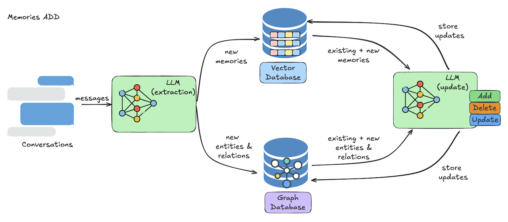
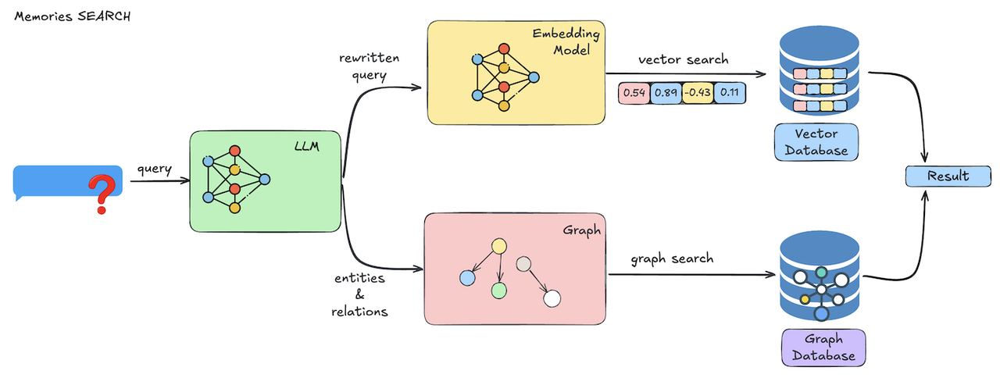
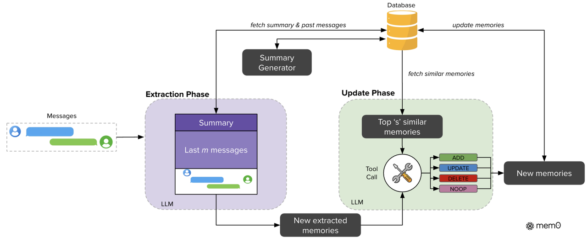
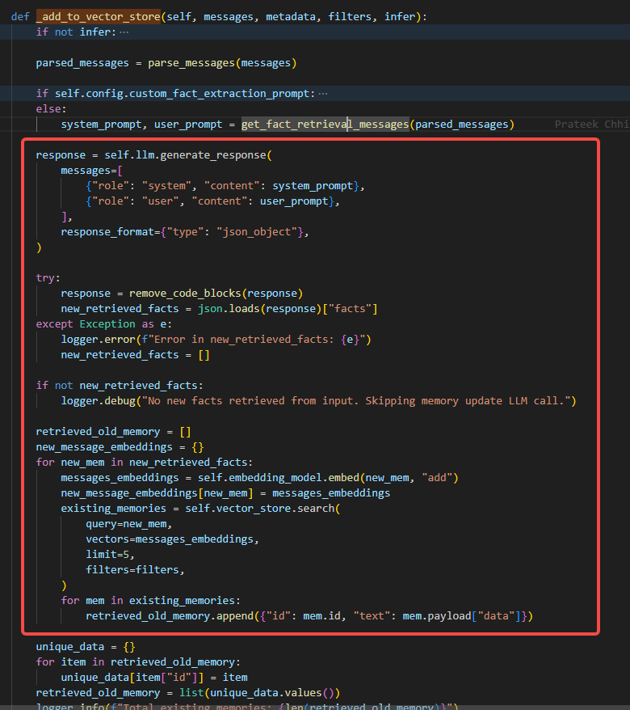
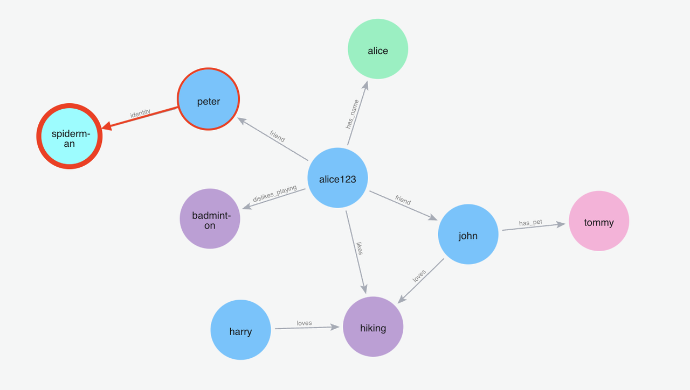
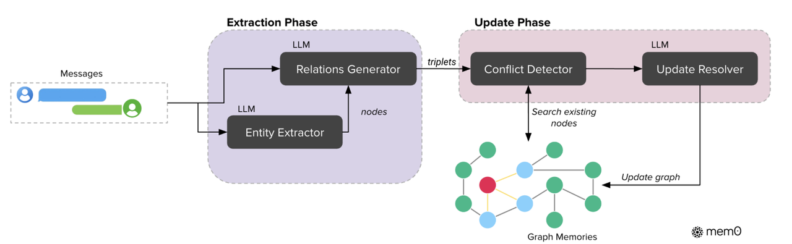

> 因工作原因，需要了解下业内Agent记忆系统方案
>
> Mem0作为业内早期的记忆系统，整体方案相对偏朴素
>
> 这套方案，其核心完全基于LLM。最初看感觉不够惊艳，不过随着AI的进展，感觉这套方案也不是不行

> [https://mem0.ai/](https://mem0.ai/)
>
> [Mem0: Building Production-Ready AI Agents with Scalable Long-Term Memory](https://arxiv.org/abs/2504.19413)

# 应用视角设计

> 调用新增接口时，通过LLM提取messages中的事实、决策、偏好、事件等形成记忆(支持文本、图两种方式)，而后从数据库中检索与当前记忆相似的记忆，并通过LLM决定的更新策略，最后持久化到数据库。



> 调用搜索接口时，首先通过LLM精炼和优化用户query，而后将其通过嵌入模型将精炼后的query向量化，并通过相似度筛选top-k相似记忆，随后执行用户设置的过滤和重排，最后拼装元信息并返回结果




# $mem0$


```json
//记忆结构
{
    "id",//uuid
    "vector",//embedding
    "payloads":{//meta data
        "data",//memory
        "hash",//校验
        "created_at",//创建时间
        "user_id",
        "agent_id",
        "run_id",
        ...//允许用户自定义添加字段
    }
}
```


## 记忆提取

### Summary Generator

> 输入: 历史对话信息
>
> 输出: 摘要信息

> 动机/收益：
>
> - 提供会话全局信息
> - 减轻上下文负担
> - 方便抽取记忆项

基于LLM实现摘要，引文选用GPT-4o-mini。(异步、周期执行)

### Memmory Extractor

> 输入:
>
> - 会话摘要
> - 历史最近m条对话
> - 当前轮对话
>
> 输出: 记忆项

> 动机/收益：
>
> - 关键信息抽取
> - 兼顾会话的全局&最新信息

基于LLM抽取记忆项, 引文选用GPT-4o-mini

```python
def _add_to_vector_store(self, messages, metadata, filters, infer):
    # 不采用LLM提取
    if not infer:
        returned_memories = []
        for message_dict in messages:
            if (
                not isinstance(message_dict, dict)
                or message_dict.get("role") is None
                or message_dict.get("content") is None
            ):
                logger.warning(f"Skipping invalid message format: {message_dict}")
                continue

            if message_dict["role"] == "system":
                continue

            per_msg_meta = deepcopy(metadata)
            per_msg_meta["role"] = message_dict["role"]

            actor_name = message_dict.get("name")
            if actor_name:
                per_msg_meta["actor_id"] = actor_name

            msg_content = message_dict["content"]
            msg_embeddings = self.embedding_model.embed(msg_content, "add")
            mem_id = self._create_memory(msg_content, msg_embeddings, per_msg_meta)

            returned_memories.append(
                {
                    "id": mem_id,
                    "memory": msg_content,
                    "event": "ADD",
                    "actor_id": actor_name if actor_name else None,
                    "role": message_dict["role"],
                }
            )
        return returned_memories
```



## 记忆管理

> Memory Manager
>
> 输入：记忆项
>
> 输出：操作

> 动机/收益：
>
> - 智能更新策略
>   - 检索top-k条相似记忆项
>   - 对比决定操作（CRUD）
> - 记忆可以回溯

基于LLM的function Call, 引文选用GPT-4o-mini

> 检索相似记忆，LLM决定更新操作
> 

```python
# 调用LLM
response = self.llm.generate_response(
            messages=[
                {"role": "system", "content": system_prompt},
                {"role": "user", "content": user_prompt},
            ],
            response_format={"type": "json_object"},
        )

        try:
            response = remove_code_blocks(response)
            new_retrieved_facts = json.loads(response)["facts"]
        except Exception as e:
            logger.error(f"Error in new_retrieved_facts: {e}")
            new_retrieved_facts = []

        if not new_retrieved_facts:
logger.debug("No new facts retrieved from input. Skipping memory update LLM call.")

# 获取oldMemory
retrieved_old_memory = []
new_message_embeddings = {}
for new_mem in new_retrieved_facts:
    messages_embeddings = self.embedding_model.embed(new_mem, "add")
    new_message_embeddings[new_mem] = messages_embeddings
    existing_memories = self.vector_store.search(
        query=new_mem,
        vectors=messages_embeddings,
        limit=5,
        filters=filters,
    )
    for mem in existing_memories:
        retrieved_old_memory.append({"id": mem.id, "text": mem.payload["data"]})

unique_data = {}
for item in retrieved_old_memory:
    unique_data[item["id"]] = item
retrieved_old_memory = list(unique_data.values())
logger.info(f"Total existing memories: {len(retrieved_old_memory)}")

# mapping UUIDs with integers for handling UUID hallucinations
temp_uuid_mapping = {}
for idx, item in enumerate(retrieved_old_memory):
    temp_uuid_mapping[str(idx)] = item["id"]
    retrieved_old_memory[idx]["id"] = str(idx)

# LLM决定具体记忆操作
if new_retrieved_facts:
    function_calling_prompt = get_update_memory_messages(
        retrieved_old_memory, new_retrieved_facts, self.config.custom_update_memory_prompt
    )

    try:
        response: str = self.llm.generate_response(
            messages=[{"role": "user", "content": function_calling_prompt}],
            response_format={"type": "json_object"},
        )
    except Exception as e:
        logger.error(f"Error in new memory actions response: {e}")
        response = ""

    try:
        response = remove_code_blocks(response)
        new_memories_with_actions = json.loads(response)
    except Exception as e:
        logger.error(f"Invalid JSON response: {e}")
        new_memories_with_actions = {}
else:
    new_memories_with_actions = {}
```

## 记忆检索

> 输入：用户query
> 输出：记忆项

> 动机/收益：
>
> - query 精炼，降低口语化/噪声对召回的干扰
> - 向量检索 + 重排，兼顾召回率与精度
> - 支持元数据过滤（user_id/agent_id/run_id 等），实现记忆隔离

1. LLM精炼/优化用户query
2. 精炼后query转向量
3. 向量相似度匹配、重排

# $mem0^g$

> 图结构定义(Directed label graph)
>
> 

|      | 定义       | 备注                                                                |
| ---- | ---------- | ------------------------------------------------------------------- |
| 节点 | 实体       | 包含：人员、地点、物体、概念、事件、核心属性等名词；带实体类型/标签 |
| 边   | 实体间关系 | 形如三元组 `(entity1, relation, entity2)`，带方向                 |



<table>
  <thead>
    <tr>
      <th></th>
      <th>核心组件/策略</th>
      <th>输入</th>
      <th>输出</th>
      <th>动机/收益</th>
      <th>实现</th>
    </tr>
  </thead>
  <tbody>
    <tr>
      <td rowspan="2"><strong>记忆提取</strong></td>
      <td>Entity Extractor</td>
      <td>文本</td>
      <td>节点集</td>
      <td>捕捉文本中关键实体，用以构建图结构</td>
      <td>基于LLM Function Call（引文选用GPT-4o-mini）</td>
    </tr>
    <tr>
      <td>Relations Extractor</td>
      <td>文本、关系集</td>
      <td>关系集</td>
      <td>捕捉结构层的语义信息</td>
      <td>基于LLM实体关系分析（引文选用GPT-4o-mini）</td>
    </tr>
    <tr>
      <td rowspan="2"><strong>记忆管理</strong></td>
      <td>Conflict Detector</td>
      <td>关系集、图</td>
      <td>节点、关系集</td>
      <td>每条关系与当前图做融合、清洗</td>
      <td>关系中节点与当前图中节点相似性比较</td>
    </tr>
    <tr>
      <td>Update Resolver</td>
      <td>关系集</td>
      <td>更新操作</td>
      <td>决定某些关系被废弃</td>
      <td>基于LLM Function Call（引文选用GPT-4o-mini）</td>
    </tr>
    <tr>
      <td rowspan="2"><strong>记忆检索</strong></td>
      <td>基于实体的检索</td>
      <td>用户query</td>
      <td>节点、关系集</td>
      <td>实体相关性深度关联检索</td>
      <td>1. 识别query中关键实体<br>2. 记忆图中检索与query相似实体<br>3. 检索与相似实体相关的节点和边，输出相关子图<br>4. bm25排序</td>
    </tr>
    <tr>
      <td>基于关系的检索</td>
      <td>用户query</td>
      <td>关系集</td>
      <td>关系相关性检索</td>
      <td>1. 直接对query做embedding<br>2. 与图中的关系做相似度匹配</td>
    </tr>
  </tbody>
</table>

# 开源SDK

- 兼容openai api
- 支持自定义内置LLM组件（包括信息抽取模型&embedding模型）和Prompt
- 支持图像：基本原理=> 图像理解+ocr+上下文 => 文本 => 记忆
- 提供REST API

# 总结

<table>
  <thead>
    <tr>
      <th>功能模块</th>
      <th colspan="2">核心方案</th>
      <th>启发/建议</th>
    </tr>
  </thead>
  <tbody>
    <tr>
      <td rowspan="2"><strong>记忆提取</strong></td>
      <td>文本</td>
      <td>基于LLM构建的对话、历史、摘要的记忆摘取策略</td>
      <td rowspan="2">
        <ul style="margin: 0; padding-left: 1.2em;">
          <li>全局(摘要)+最新(历史+当前query)的记忆提取</li>
          <li>基于LLM的记忆提取策略</li>
        </ul>
      </td>
    </tr>
    <tr>
      <td>图</td>
      <td>基于LLM构建的对话、历史、摘要的记忆摘取策略</td>
    </tr>
    <tr>
      <td rowspan="4"><strong>记忆管理</strong></td>
      <td rowspan="2">记忆检索</td>
      <td>基于向量相似度的检索</td>
      <td rowspan="2">图结构的双重检索策略提高信息检索能力</td>
    </tr>
    <tr>
      <td>基于图结构设计的双重检索策略</td>
    </tr>
    <tr>
      <td>记忆压缩</td>
      <td>基于LLM异步定期上下文压缩</td>
      <td>异步上下文压缩，减轻Prompt负载</td>
    </tr>
    <tr>
      <td>记忆更新</td>
      <td>检索top-k相似记忆，交由LLM决定具体CRUD</td>
      <td>基于LLM的top-k相似记忆矛盾检测</td>
    </tr>
    <tr>
      <td rowspan="2"><strong>记忆存储</strong></td>
      <td>文本</td>
      <td>文本数据库、向量数据库</td>
      <td rowspan="2">向量+图混合使用互相弥补查询遗漏</td>
    </tr>
    <tr>
      <td>图</td>
      <td>向量数据库、图数据库</td>
    </tr>
  </tbody>
</table>
