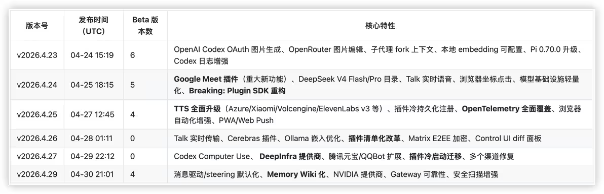
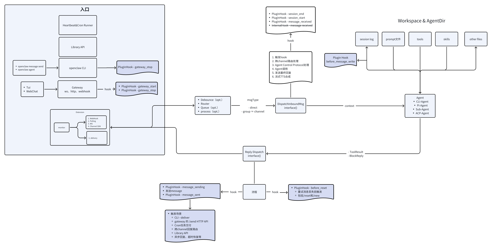
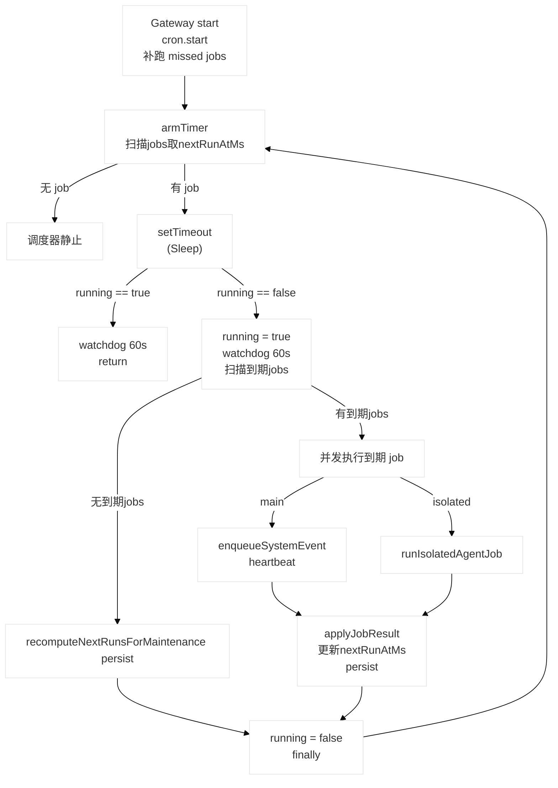
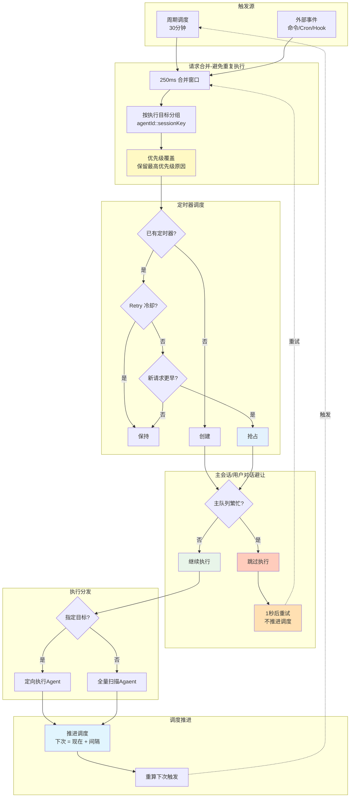
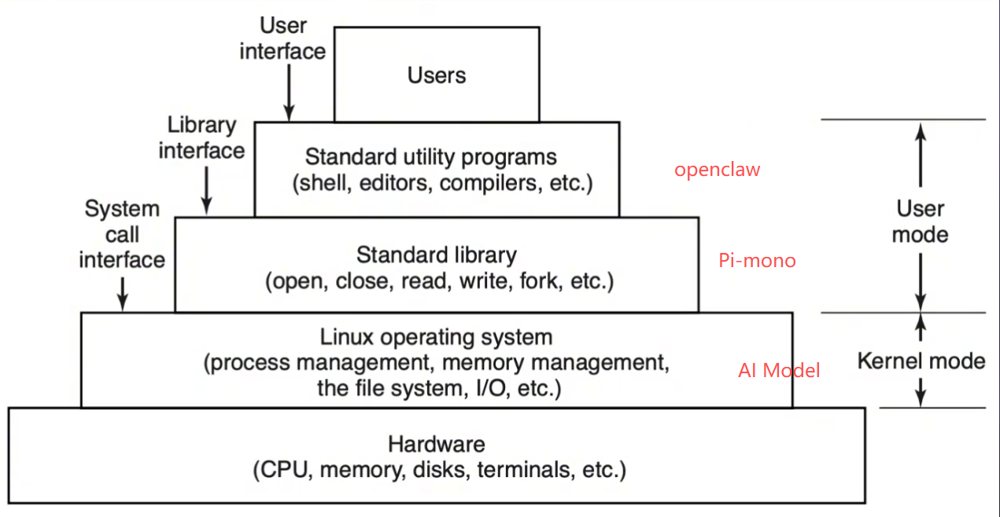
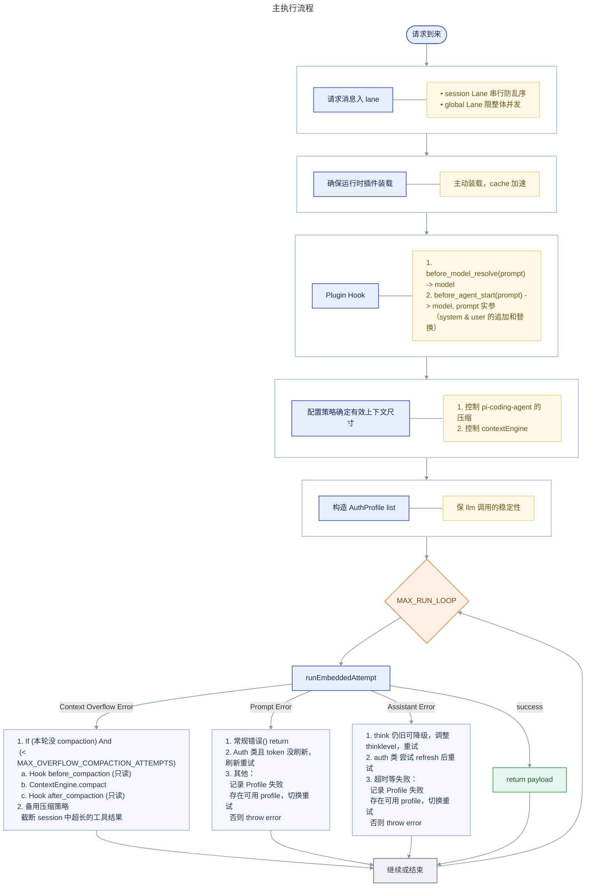
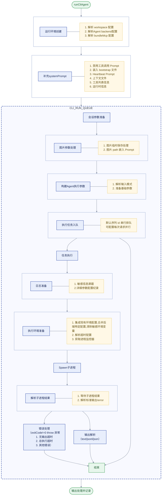
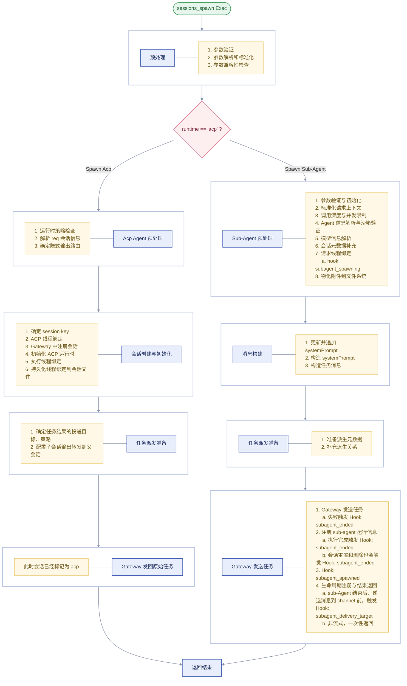
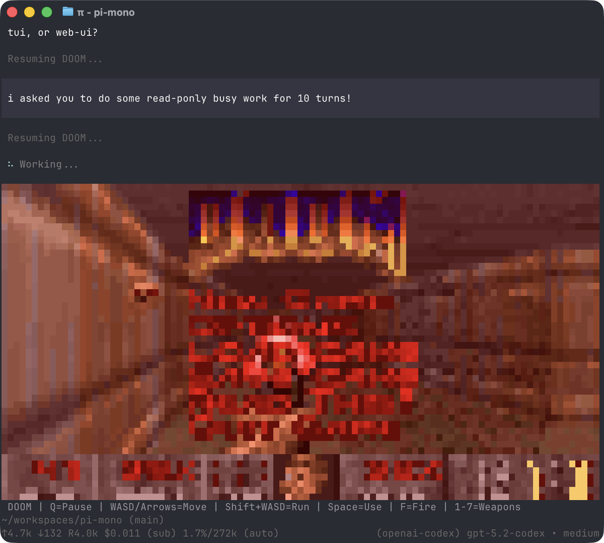

> 网上材料众多，但大多浮于应用层，一些宣称源码解析，大多都采用AI糊弄或浅尝辄止。参考价值较低
>
> 推荐/参考材料（有先后顺序）
>
> - https://space.bilibili.com/2116722913
> - https://space.bilibili.com/3691010037123684
> - https://www.youtube.com/@JingShis
>   - https://github.com/Amyssjj/Agent_Exploration/tree/main/LearningNotes

> 另外openclaw本身的活跃加上vibe-coding带来的加速，其演进飞快。
> 
> 30 天内发布 6 个稳定版本 + 19 个 Beta 版本 = 平均每 1.2 个工作日一个版本。
>
> ```text
> 周         总提交数    日均       备注
> 2026-03-08  1,805     258        基线条
> 2026-03-15  1,897     271        稳步增长
> 2026-03-22  2,689     384        加速
> 2026-03-29  3,313     473        进入冲刺期
> 2026-04-05  4,022     575 🚨     历史峰值！
> 2026-04-12  1,851     264        略有回落
> 2026-04-19  3,584     512 🚨     又一个高峰
> 2026-04-26  3,603     515 🚨     持续高压
> ```
>
> Linux内核每周约 1,000–1,500 次提交。OpenClaw 4 月的峰值达到 Linux 内核的 3–4 倍
> https://www.bilibili.com/opus/1197816041901654035?spm_id_from=333.1007.> top_right_bar_window_dynamic.content.click
>
> 因此
>
> 1. 本篇也只能抛砖引玉，很难做到无死角/分毫不差
> 2. 本篇介绍（除memoryWiki和dreaming）主要基于2026.3.8和2026.3.14
> 3. 也提醒各位 尤其生产环境，谨慎更新（4.30版本webchat发送消息后有卡死
> 4. 由于本文篇幅较长，因此将memory模块解析见[Openclaw Memory](/blog/openclawmemory/)

# Overview



# Core Component

## Gateway

官方暂未原生支持集成消息中间件

消息在不同阶段崩溃时的持久化情况与重启后表现见[消息持久化](#消息持久化)

### Multiplexed Port

> 端口复用不意味着gateway只占用一个端口

**Gateway的端口占用情况**

| Port Type                | Default Port | Derivation Formula           | Bind Address       | External Access | Purpose                                                                         |
| ------------------------ | ------------ | ---------------------------- | ------------------ | --------------- | ------------------------------------------------------------------------------- |
| Gateway Main             | 18789        | Base port (configurable)     | Loopback or custom | Yes             | 单一多路复用端口，承载 WebSocket 控制、HTTP API、Control UI、Canvas、健康检查   |
| Canvas Host              | 18789        | Same as Gateway              | Same as Gateway    | Yes             | Canvas 协作服务                                                                 |
| Bridge                   | 18790        | Base + 1                     | Loopback only      | No              | 内部桥接服务，用于进程间通信                                                    |
| Browser Control          | 18791        | Base + 2                     | Loopback only      | No              | Gateway 与浏览器控制服务通信（启停 Chrome、管理 Chrome DevTools Protocol 连接） |
| Chrome DevTools Protocol | 18800-18899  | Browser Control Port + 9~108 | Loopback only      | No              | Chrome DevTools Protocol 端口池（共 100 个端口，供浏览器 profile 自动分配）     |

- WebSocket control（openclaw自定义json协议）
- Request/Response control

> <table>
>   <thead>
>     <tr>
>       <th>分类</th>
>       <th>场景名</th>
>       <th>启用条件</th>
>       <th>功能</th>
>     </tr>
>   </thead>
>   <tbody>
>     <tr>
>       <td rowspan="5">核心网关 API</td>
>       <td>hooks</td>
>       <td rowspan="5">固定启用</td>
>       <td>Webhook 事件回调处理</td>
>     </tr>
>     <tr>
>       <td>tools-invoke</td>
>       <td>工具调用 HTTP 接口(需鉴权+限流)</td>
>     </tr>
>     <tr>
>       <td>sessions-kill</td>
>       <td>终止指定会话</td>
>     </tr>
>     <tr>
>       <td>sessions-history</td>
>       <td>查询会话历史记录</td>
>     </tr>
>     <tr>
>       <td>slack(历史包袱)</td>
>       <td>Slack 集成回调端点</td>
>     </tr>
>     <tr>
>       <td rowspan="2">LLM 协议兼容</td>
>       <td>open responses</td>
>       <td>openResponsesEnabled</td>
>       <td>OpenAI Responses API 兼容接口</td>
>     </tr>
>     <tr>
>       <td>openai</td>
>       <td>openAiChatCompletionsEnabled</td>
>       <td>OpenAI Chat Completions 兼容接口</td>
>     </tr>
>     <tr>
>       <td rowspan="3">Canvas 子系统</td>
>       <td>canvas-auth</td>
>       <td rowspan="3">canvasHost !== null</td>
>       <td>Canvas 路径统一鉴权守卫</td>
>     </tr>
>     <tr>
>       <td>a2ui</td>
>       <td>A2UI 协议端点</td>
>     </tr>
>     <tr>
>       <td>canvas-http</td>
>       <td>Canvas 静态资源/HTTP 服务</td>
>     </tr>
>     <tr>
>       <td rowspan="2">插件扩展</td>
>       <td>plugin-auth</td>
>       <td rowspan="2">handlePluginRequest 已注册</td>
>       <td>插件路由鉴权</td>
>     </tr>
>     <tr>
>       <td>plugin-http</td>
>       <td>插件自定义 HTTP 路由分发</td>
>     </tr>
>     <tr>
>       <td rowspan="2">Control UI</td>
>       <td>control-ui-avatar</td>
>       <td rowspan="2">controlUiEnabled</td>
>       <td>Agent 头像静态资源</td>
>     </tr>
>     <tr>
>       <td>control-ui-http</td>
>       <td>Control UI SPA(通配兜底)</td>
>     </tr>
>     <tr>
>       <td rowspan="2">基础设施</td>
>       <td>gateway-probes</td>
>       <td rowspan="2">固定启用</td>
>       <td>健康/就绪探针(/healthz、/readyz)</td>
>     </tr>
>     <tr>
>       <td>—</td>
>       <td>全部未命中 → 404 Not Found</td>
>     </tr>
>   </tbody>
> </table>
>
> ```ts
> // 责任链+短路
> async function runGatewayHttpRequestStages(
>   stages: readonly GatewayHttpRequestStage[],
> ): Promise<boolean> {
>   for (const stage of stages) { 
>     if (await stage.run()) {
>       return true;
>     }
>   }
>   return false;
> }
>
> ```

### Configuration

- an optional JSON5 config from `~/.openclaw/openclaw.json`
- env vars from `~/.openclaw/.env`

### Network

- Loopback 优先，非loopback需要配置及鉴权
- 建议单host单网关，但也支持单host多网关

```bash
# Rescue bot (separate Telegram bot, separate profile, port 19789)
openclaw --profile rescue onboard
openclaw --profile rescue gateway --port 19789
```

- Remote access

  - Preferred: Tailscale（组虚拟网）

  - Fallback: SSH tunnel

### Protocol

**WebSocket**

> 数据帧携带JSON负载
> demo
>
> ```json
> # ws握手
>
> # pre-Connect
> {
>   "type": "event",
>   "event": "connect.challenge",
>   "payload": { "nonce": "…", "ts": 1737264000000 }
> }
>
> # Client-info
> {
>   "type": "req",
>   "id": "…",
>   "method": "connect",
>   "params": {
>     "minProtocol": 3,
>     "maxProtocol": 3,
>     "client": {
>       "id": "cli",
>       "version": "1.2.3",
>       "platform": "macos",
>       "mode": "operator"
>     },
>     "role": "operator",
>     "scopes": ["operator.read", "operator.write"],
>     "caps": [],
>     "commands": [],
>     "permissions": {},
>     "auth": { "token": "…" },
>     "locale": "en-US",
>     "userAgent": "openclaw-cli/1.2.3",
>     "device": {
>       "id": "device_fingerprint",
>       "publicKey": "…",
>       "signature": "…",
>       "signedAt": 1737264000000,
>       "nonce": "…"
>     }
>   }
> }
>
> # ok
> {
>   "type": "res",
>   "id": "…",
>   "ok": true,
>   "payload": { "type": "hello-ok", "protocol": 3, "policy": { "tickIntervalMs": 15000 } }
> }
>
> # 交互msg
> ```

**OpenAI-compatible Endpoint**

> 默认禁用

```json
{
  gateway: {
    http: {
      endpoints: {
        chatCompletions: { enabled: true },
        responses: { enabled: true },
      },
    },
  },
}
```

暴漏接口

- `POST /v1/responses`
- `GET /v1/models`
- `GET /v1/models/{id}`
- `POST /v1/embeddings`
- `POST /v1/chat/completions`

```bash
curl -N http://127.0.0.1:18789/v1/responses \
  -H 'Authorization: Bearer YOUR_TOKEN' \
  -H 'Content-Type: application/json' \
  -H 'x-openclaw-agent-id: main' \
  -d '{
    "model": "openclaw/<agentId>", # 路由到特定的智能体
    "stream": true, # 返回SSE
    "input": "hi"
  }'
```

- 默认每次请求无状态，生成新的session key（可携带user字段以固定sesssion key,实现共享会话）
- 支持返回模型提供商返回的usage，并对其标准化（`input_tokens` / `output_tokens` and `prompt_tokens` / `completion_tokens`）

<br>

**Tools Invoke API**

> 提供了直接调用单个工具的HTTP Endpoint

- 暴露 `POST /tools/invoke`

> ```bash
> # 2MB Body
> curl -sS http://127.0.0.1:18789/tools/invoke \
>   -H 'Authorization: Bearer secret' \
>   -H 'Content-Type: application/json' \
>   -d '{
>     "tool": "sessions_list",
>     "action": "json",
>     "args": {}
>     "sessionKey": "main",
>     "dryRun": false
>   }'
> ```

- 工具调用API的权限管理 复用 Agent的策略链(profile + allow + group + subagent)
- 默认禁用高危工具 (exec、shell、fs_write、gateway 等)

**Webhook**

> Gateway支持暴漏HTTP webhook endpoints由外部触发

```json
{
  hooks: {
    enabled: true,
    token: "shared-secret",
    path: "/hooks",
  },
}
```

- `POST /hooks/wake` : Enqueue a system event for the main session
- `POST hooks/agent` : Run an isolated agent turn
- Mapped hooks `POST /hooks/<name>`
  > - resolved via hooks.mappings in config
  > - transform arbitrary payloads into wake or agent actions with templates or code
  >

## Message

1. routing/binding -> session key
2. Queue
3. Agent run
4. outbound replies (channel limits + chunking)

### 消息持久化

<table>
  <thead>
    <tr>
      <th>崩溃时刻</th>
      <th>阶段</th>
      <th>消息所在位置</th>
      <th>持久化？</th>
      <th>重启后现象</th>
    </tr>
  </thead>
  <tbody>
    <tr>
      <td>消息从 Channel 进入，正等待 debounce 窗口合并同一用户短时的连续消息</td>
      <td>阶段 1：Debounce 窗口内</td>
      <td>Map<string, DebounceBuffer>（内存）</td>
      <td>N</td>
      <td>消息完全丢失</td>
    </tr>
    <tr>
      <td>消息已通过 debounce，进入 per-session 的 FIFO 内存队列，等待前一个 agent run 结束</td>
      <td>阶段 2：Followup 队列中</td>
      <td>FOLLOWUP_QUEUES 全局 Map（内存）</td>
      <td>N</td>
      <td>消息完全丢失</td>
    </tr>
    <tr>
      <td>消息从队列取出，正在初始化 session 上下文（加载 transcript、解析配置）</td>
      <td>阶段 3：Agent run 启动前</td>
      <td>SessionManager（内存）</td>
      <td>N</td>
      <td>消息丢失，session 历史不包含此消息</td>
    </tr>
    <tr>
      <td>用户消息已写入 transcript 文件，LLM 正在生成回复，回复尚未完成</td>
      <td>阶段 3：Agent run 已启动</td>
      <td>内存 + transcript JSONL 文件</td>
      <td>Y</td>
      <td>用户消息保留在 transcript，但 AI 回复丢失，不会自动重新生成，需用户重发触发</td>
    </tr>
    <tr>
      <td>AI 回复已生成并写入 delivery-queue/{id}.json，等待发送或发送中</td>
      <td>阶段 4：回复已写入出站队列</td>
      <td>delivery-queue/{id}.json</td>
      <td>Y</td>
      <td>重启后自动恢复，指数退避重试（5s → 25s → 2m → 10m），最多 5 次</td>
    </tr>
    <tr>
      <td>消息已发送成功，正在执行两阶段确认的第二步（删除 .delivered 标记）</td>
      <td>阶段 4：发送成功，rename 为 .delivered</td>
      <td>.delivered</td>
      <td>Y</td>
      <td>重启后清理标记，不会重复发送</td>
    </tr>
  </tbody>
</table>

### Inbound

- 重连可能触发Channel重放消息，故会缓存短声明周期消息实现同chanel消息去重
- 来自同一发送方的连续快速消息可通过 `messages.inbound`批量合并为一次智能体交互

```json
{
  messages: {
    inbound: {
      debounceMs: 2000,
      byChannel: {
        whatsapp: 5000,
        slack: 1500,
        discord: 1500,
      },
    },
  },
}
```

- Queue modes
  - `steer`：立即注入当前运行中，既执行完当前正在执行的工具后注入
  - `followup`：加入下一个智能体轮次的队列
  - `steer-backlog`: steer并followup
  - `collect`： 将所有排队的消息合并到下一轮
  - `interrupt` : 中断
- 全局受并行配置 `agents.defaults.maxConcurrent`限制，单会话串行

### Outbound

- 可调整推理结果可见性
- 可集中管理外发消息的格式设置
  - `messages.responsePrefix`, `channels.<channel>.responsePrefix`, and `channels.<channel>.accounts.<id>.responsePrefix` (outbound prefix cascade), plus `channels.whatsapp.messagePrefix` (WhatsApp inbound prefix)
  - Reply threading via replyToMode and per-channel defaults
- 流式输出&分块
  - Block Streaming：流式输出Block作为模型回复
    - 切分策略包括（下界、上界、切分符号、代码屏障/md）
    - 支持配置启用合并连续的块
    - 流式块模式，可以添加随机暂停使得块输出更自然
      > ```js
      > sendChain = sendChain
      >   .then(async () => {
      >     // Add human-like delay between block replies for > natural rhythm.
      >     if (shouldDelay) {
      >       const delayMs = getHumanDelay(options.humanDelay);
      >       if (delayMs > 0) {
      >         await sleep(delayMs);
      >       }
      >     }
      >     // Safe: deliver is called inside an async .then() > callback, so even a synchronous
      >     // throw becomes a rejection that flows through .> catch()/.finally(), ensuring cleanup.
      >     await options.deliver(normalized, { kind });
      >   })
      >   
      > const DEFAULT_HUMAN_DELAY_MIN_MS = 800;
      > const DEFAULT_HUMAN_DELAY_MAX_MS = 2500;
      >
      >   /** Generate a random delay within the configured > range. */
      > function getHumanDelay(config: HumanDelayConfig |undefined): number {
      >   const mode = config?.mode ?? "off";
      >   if (mode === "off") {
      >     return 0;
      >   }
      >   const min =
      >     mode === "custom" ? (config?.minMs ?? DEFAULT_HUMAN_DELAY_MIN_MS) : DEFAULT_HUMAN_DELAY_MIN_MS;
      >   const max =
      >     mode === "custom" ? (config?.maxMs ?? DEFAULT_HUMAN_DELAY_MAX_MS) : DEFAULT_HUMAN_DELAY_MAX_MS;
      >   if (max <= min) {
      >     return min;
      >   }
      >   return Math.floor(Math.random() * (max - min + 1)) + > min;
      > }
      > ```
      >
  - Preview Streaming: 生成时不断更新临时可见的消息
- 输出支持配置重试（幂等）

## Scheduler

### Corn



> 注：定时器采用线性表（未采用红黑树、优先队列、时间轮等常见数据结构）
> 内置在gateway中，用于持久化一个job(`~/.openclaw/cron/jobs.json`)，而后在设定时间唤醒Agent工作，并将结果投递到设定Channel或webhook

- Cron执行会创建background task，与主会话隔离
- Cron结束会尽量清理相关资源，避免资源泄露（孤儿进程等）
- Deterministic Stagger (防惊群设计-Thundering Herd Problem)
  - 基于job-ID的确定性分散
  - 基于SHA-256获得的均匀分布
  - 基于内存的FIFO缓存

**Schedule types**（时间表达式）

| Kind  | CLI flag    | Description                                           |
| ----- | ----------- | ----------------------------------------------------- |
| at    | `--at`    | One-shot timestamp (ISO 8601 or relative like 20m)    |
| every | `--every` | Fixed interval                                        |
| cron  | `--cron`  | 5-field or 6-field cron expression with optional --tz |

**Execution styles**

| Style           | --session value       | Runs in                    | Best for                        |
| --------------- | --------------------- | -------------------------- | ------------------------------- |
| Main session    | `main`              | Next heartbeat turn        | Reminders, system events        |
| Isolated        | `isolated`          | Dedicated `cron:<jobId>` | Reports, background chores      |
| Current session | `current`           | Bound at creation time     | Context-aware recurring work    |
| Custom session  | `session:custom-id` | Persistent named session   | Workflows that build on history |

**Delivery and output**

- `announce`：Deliver summary to target channel (default for isolated)
- `webhook`：POST finished event payload to a URL
- `none`：Internal only, no delivery

### Heartbeat



- 配置热装载

```json
{
  "agents": {
    "defaults": {
      "heartbeat": {
        "every": "30m",                    // 每 30 分钟一次
        "target": "last",                  // 发送到最后一个对话的地方
        "lightContext": true,              // 触发时仅装载HEARTBEAT.md忽略其他bootstrap文件
        "prompt": "检查健康状态"            // Heartbeat Prompt
        "activeHours": {                   // 只在 8:00-22:00 运行
          "start": "08:00",
          "end": "22:00",
          "timezone": "America/Los_Angeles"
        }
      }
    }
  }
}
```

- 定制业务逻辑卸载HEARTBEAT.md中
- getaway启动时，为每个agent维护独立的定时器
- 无需关注，agent会智能回复HEARTBEAT_OK，系统不会发送消息给用户

| 触发者         | 触发条件                                                          | Heartbeat Prompt                                                                                                                                                                          | Provider 标记 |
| -------------- | ----------------------------------------------------------------- | ----------------------------------------------------------------------------------------------------------------------------------------------------------------------------------------- | ------------- |
| Gateway 定时器 | 定时触发                                                          | Read HEARTBEAT.md if it exists (workspace context).`<br>`Follow it strictly. Do not infer or repeat old tasks from prior chats. `<br>`If nothing needs attention, reply HEARTBEAT_OK. | heartbeat     |
| Cron           | sessionTarget == "main"                                           | A scheduled reminder has been triggered. The reminder content is:`<br><br>`{事件文本} `<br><br>`Please relay this reminder to the user in a helpful and friendly way.                 | cron-event    |
| Exec           | bash-tools.exec 派生的子进程退出时                                | An async command you ran earlier has completed.`<br>`The result is shown in the system messages above. `<br>`Please relay the command output to the user in a helpful way...          | exec-event    |
| Hook           | `curl -X POST http://localhost:3456/wake`（同 Gateway 定时器）  | 同 Gateway 定时器                                                                                                                                                                         | heartbeat     |
| CLI            | `openclaw system event --text "Reminder" --mode next-heartbeat` | 同 Gateway 定时器                                                                                                                                                                         | heartbeat     |

### Task

- Task是执行实例而非scheduler，运行在后台，持久化在 `$OPENCLAW_STATE_DIR/tasks/runs.sqlite`
- Task的runId会绑定到Agent运行来工作，Agent的声明周期会自动同步到Task status

| Category               | Runtime type | When a task record is created                    | Default notify policy |
| ---------------------- | ------------ | ------------------------------------------------ | --------------------- |
| ACP background runs    | acp          | Spawning child ACP session                       | done_only             |
| Subagent orchestration | subagent     | sessions_spawn                                   | done_only             |
| Cron jobs (all types)  | cron         | Every cron execution                             | silent                |
| CLI operations         | cli          | openclaw agent cmds that run through the gateway | silent                |
| Agent media jobs       | cli          | Session-backed video_generate                    | silent                |

**Task递送模式与通知策略**

| 模式                    | 描述                                                                                           |
| ----------------------- | ---------------------------------------------------------------------------------------------- |
| Direct delivery         | 任务有目标channel直接递送。sub-agent还会保留thread/topic，并在缺失acount时候补充路由           |
| Session-queued delivery | Direct delivery失败或未设置递送源，调整为系统时间并排队到请求方会话中，在下一次heartbeat时显示 |

| 通知策略            | 描述                                          |
| ------------------- | --------------------------------------------- |
| done_only (default) | Only terminal state (succeeded, failed, etc.) |
| state_changes       | Every state transition and progress update    |
| silent              | Nothing at all                                |

### Task Flow

- 当工作设计多个顺序或者分支步骤，且需要再网关重启后实现持久化的进度跟踪
- 各Task Flow持久化自身状态，追踪修订进度，故而进度不因网关重启丢失。修改的追踪会在多数据源推进时检测冲突
- Flow协调Task，故flow在其生命周期内可驱动多个task
- `openclaw tasks flow list`: Shows tracked flows with status and sync mode
- `openclaw tasks flow show <id>`：Inspect one flow by flow id or lookup key
- `openclaw tasks flow cancel <id>`： Cancel a running flow and its active tasks

### Hooks

- 发生特定事件时运行的脚本，从多个目录中识别，通过openclaw hooks管理
- 发现顺序 `Bundled hooks`<`Plugin hooks`<`Managed hooks`<`Workspace hooks`

**Bundled hooks**

| Hook                  | Events                     | What it does                                          |
| --------------------- | -------------------------- | ----------------------------------------------------- |
| session-memory        | command:new, command:reset | Saves session context to`<workspace>`/memory/       |
| bootstrap-extra-files | agent:bootstrap            | Injects additional bootstrap files from glob patterns |
| command-logger        | command                    | Logs all commands to ~/.openclaw/logs/commands.log    |
| boot-md               | gateway:startup            | Runs BOOT.md when the gateway starts                  |

**Hook Structure**

```bash
my-hook/
├── HOOK.md          # Metadata(参照skill) + documentation
└── handler.ts       # Handler implementation
```

```ts
const handler = async (event) => {
  if (event.type !== "command" || event.action !== "new") {
    return;
  }
  console.log(`[my-hook] New command triggered`);
  // Your logic here

  // Optionally send message to user
  event.messages.push("Hook executed!");
};

export default handler;
```

## Sandbox

> 主要针对和验证了docker场景的

```json
{
  "agents": {
    "defaults": {
      "sandbox": {
        "mode": "non-main",           // off | non-main(非主会话不安全) | all
        "scope": "agent",             // session | agent | shared
        "workspaceAccess": "none",    // none | ro | rw
        "docker": {
          "image": "openclaw-sandbox-common:bookworm-slim"
          "binds": ["/etc:/etc:rw"]   // 挂载宿主机 /etc
        }
      }
    }
  },
  "tools": {
    "elevated": {      // 提权工具
      "enabled": true,
      "allowFrom": {
        "webchat": [
          "*"
        ]
      }
    },
    "sandbox": {     // 沙箱工具策略
      "tools": {
        "allow": ["exec", "read", "write", "edit"],
        "deny": ["browser", "canvas", "cron", "gateway"]
      }
    }
  },
}
```

- 开启时，仅部分预设工具执行在隔离的沙盒
  > - 实际执行时
  >   - 读文件： 宿主机直接读更快，且只读操作安全
  >   - 写文件： 必须在容器内执行，确保权限和环境一致
  > - 插件工具暂不支持原因推测:
  >   1. 插件多数不涉及本地环境
  >   2. 容器支持完整插件运行时成本过高
  >   3. 可让插件执行预设工具来等价实现
  >
- 仅 `embeddedPiAgent`支持沙箱调用
- 容器以 `sleep infinity`常驻，通过 `docker exec`在容器内执行工具
  - 容器复用（刷新活跃时间）
    - 每次复用检查配置hash值
      - 热容器暂不删除，仅提醒用户 (保用户体验)
      - 冷容器重建
  - 容器清理
    - 自动 (懒清理，每次调用沙箱时检查）
      - 清理限流 (近5min有清理则跳过)
      - 清理24小时活跃，7天前创建
    - 手动 (openclaw CLI、docker CLI)
  - 隔离方案
    > 非绝对安全，但也做到了文件、进程等的基础访问限制
    >

    - 文件系统桥接
    - 工具策略控制访问范围
    - 网络隔离
      - 默认 network: "none"（无网络）
      - 禁止 network: "host"（共享宿主机网络）
      - 禁止 network: "container:<id>"（加入其他容器网络）
    - 容器权限最小化（硬编码检查）
- 宿主机配置文件
  - `~/.openclaw/sandbox/` - 元数据目录
  - `~/.openclaw/sandboxes/` - 工作空间目录
- /elevated （提权）
  - on/ask  显示批准
  - full 跳过批准
  - off 关闭提权
- Backend
  - `"docker"` (default): local Docker-backed sandbox runtime.
  - `"ssh"`: generic SSH-backed remote sandbox runtime.
  - `"openshell"`: OpenShell-backed sandbox runtime.

## Tool

- 针对不同LLM provider对tool schema 做适配
- Loop Detection

> - Warning (10-20 次)：在 tool result 中注入警告文本，LLM可见
> - Critical (20-30 次)：更强烈的警告 + 建议停止
> - Circuit Breaker (30+ 次)：直接阻断 tool 执行，返回错误

| 检测器                 | 识别的模式                    | 典型场景                                       |
| ---------------------- | ----------------------------- | ---------------------------------------------- |
| generic_repeat         | 相同 tool+参数重复 10+ 次     | Agent 反复 `read same_file.txt`              |
| known_poll_no_progress | Polling 工具结果不变 20+ 次   | `process poll` 进程卡住，Agent 一直轮询      |
| ping_pong              | A-B-A-B 交替 10+ 次且结果不变 | `read`→`write`→`read`→`write`死循环 |
| global_circuit_breaker | 任意 tool 重复 30+ 次         | 硬阻断，防止极端情况                           |

- 完善的工具权限管理机制(配置+硬编码)
- 工具结果持久化时截断
  - **大小限制**: 硬性限制为400K字符
  - **截断处理**: 超大内容会被截断,保留头部和尾部重要信息
  - **Hook触发**: 触发 tool_result_persist hook,允许插件转换结果
  - **配对验证**: 确保每个tool_use都有对应的tool_result（异常结果有填充，防止历史异常导致LLM调用报错）
  - **图像保护**: 带图像对的工具结果不剪枝
- 工具图像结果给LLM之前
  - **尺寸检查**: 检查图像是否超过限制(默认2000px和5MB)
  - **格式转换**: 转换为JPEG以减小体积
  - **质量调整**: 使用多级质量步骤 [85, 75, 65, 55, 45, 35] 逐步降低质量直到满足大小限制

### Core

> Profile预设策略

| Enum           | 工具数量 | 包含的工具                                                                                                                                                                                                                                                                                          |
| -------------- | -------- | --------------------------------------------------------------------------------------------------------------------------------------------------------------------------------------------------------------------------------------------------------------------------------------------------- |
| minimal        | 1        | `session_status`                                                                                                                                                                                                                                                                                  |
| coding（默认） | 19       | `read`, `write`, `edit`, `apply_patch`, `exec`, `process`, `web_search`, `web_fetch`, `memory_search`, `memory_get`, `sessions_list`, `sessions_history`, `sessions_send`, `sessions_spawn`, `sessions_yield`, `subagents`, `session_status`, `cron`, `image` |
| messaging      | 5        | `sessions_list`, `sessions_history`, `sessions_send`, `session_status`, `message`                                                                                                                                                                                                         |
| full           | 25+      | 所有核心工具，额外包含 `browser`, `canvas`, `gateway`, `nodes`, `agents_list`, `tts` 等                                                                                                                                                                                                 |

```ts
const CORE_TOOL_SECTION_ORDER: Array<{ id: string; label: string }> = [
  { id: "fs", label: "Files" },
  { id: "runtime", label: "Runtime" },
  { id: "web", label: "Web" },
  { id: "memory", label: "Memory" },
  { id: "sessions", label: "Sessions" },
  { id: "ui", label: "UI" },
  { id: "messaging", label: "Messaging" },
  { id: "automation", label: "Automation" },
  { id: "nodes", label: "Nodes" },
  { id: "agents", label: "Agents" },
  { id: "media", label: "Media" },
];
```

- WebSearch等昂贵工具设置内存缓存
- 一轮LLM多个tool call并行调用
- 大文件读取自动分页
- 工具支持流式结果输出
  1. 当前仅支持ui不支持LLM
  2. 暂时仅exec工具实现

```ts
execute: async (toolCallId, args, signal, onUpdate?) => {
  // 进程运行时
  process.stdout.on('data', (chunk) => {
    onUpdate?.({  // 发送增量更新
      partialResult: {
        content: [{ type: "text", text: chunk }]
      }
    })
  })
  
  // 进程结束后
  return {  // 返回完整结果
    content: [{ type: "text", text: fullOutput }]
  }
}
```

### Plugin

- 插件 manifest 里声明，运行时通过 `api.registerTool()`注册
- 禁止与Core冲突，冲突则进入黑名单

### Channel

**Message Actions**

> 消息类操作send / react / delete / poll

- 所有Channel"发消息"语义走一个 message 工具
- 通过 action 参数分发到具体通道的 handler
- LLM 只看到 1 个工具 + 1 个 action enum

**Agent Tools**

> 非消息类channel专属操作 whatsapp_login

- 无法归入"消息"语义的操作（登录、配对、管理）
- 作为独立工具暴露给 LLM
- 数量少

### Bundle MCP

> 配置mcp

```json
{
  mcp: {
    // Optional. Default: 600000 ms (10 minutes). Set 0 to disable idle eviction.
    sessionIdleTtlMs: 600000,
    servers: {
      docs: {
        command: "npx",
        args: ["-y", "@modelcontextprotocol/server-fetch"],
      },
      remote: {
        url: "https://example.com/mcp",
        transport: "streamable-http", // streamable-http | sse
        headers: {
          Authorization: "Bearer ${MCP_REMOTE_TOKEN}",
        },
      },
    },
  },
}
```

| 场景                  | OpenClaw角色 | MCP 对端                                    | 配置位置               | 作用                                                                                                    | 触发条件                                                              |
| --------------------- | ------------ | ------------------------------------------- | ---------------------- | ------------------------------------------------------------------------------------------------------- | --------------------------------------------------------------------- |
| Embedded PI Agent     | MCP client   | 外部 MCP server                             | `mcp.servers.<name>` | 把外部 MCP 工具桥接成 `AnyAgentTool`，注入 OpenClaw agent 的 tool 列表                                | -`mcp.servers` 有配置`<br>`- `tools.deny` 未屏蔽 `bundle-mcp` |
| CLI backend 配置中转  | 配置中转     | 外部 CLI（`claude`/`codex`/`gemini`） | 同上                   | 把 OpenClaw 的 MCP 配置翻译成外部 CLI 的格式                                                            | - CLI backend `bundleMcp: true<br>`- 非 `disableTools`            |
| 暴露 OpenClaw 工具    | MCP server   | 外部 CLI回调 OpenClaw                       | 无需配置               | 在 `127.0.0.1` 随机端口起 HTTP MCP server，把 OpenClaw 的 core/plugin/channel 工具暴露给外部 CLI 使用 | CLI backend 场景自动叠加                                              |
| 独立 stdio MCP server | MCP server   | ACP / CC / 其他 MCP client                  | 命令行启动             | 把 OpenClaw 的插件工具（不含 core）以 stdio MCP 协议暴露                                                | 手动执行 `plugin-tools-serve.ts`                                    |

## Node

- 针对iOS/Android/macOS/headless nodes等
- CLI借助WS，通过role=node连接到gateway。至于基于TCP JSONL的桥接协议已弃置
- 鉴权
  > 凭证位置
  > `~/.openclaw/devices/`
  >

  1. 设备生成setup code（base64的json，包含：1.Url  2.bootstrapToken）
  2. Openclaw gateway 设置setup code，并连接Node
  3. 设备批准连接
     ```bash
     openclaw devices list
     openclaw devices approve <requestId>
     openclaw devices reject <requestId>
     openclaw nodes status
     openclaw nodes describe --node <idOrNameOrIp>
     ```
- 支持Remote Node host，既将gateway接受到请求forward exec 到node上运行
  - Gateway：接受消息，运行模型，路由工具调用
  - Node host： 执行 `system.run`/`system.which`，通过 `~/.openclaw/exec-approvals.json`强制在节点主机上执行

    ```bash
    # Node Host
    # 启用
    openclaw node install --host <gateway-host> --port 18789 --display-name "Build Node"
    openclaw node restart
    # 原生rpc调用
    openclaw nodes invoke --node <idOrNameOrIp> --command canvas.eval --params '{"javaScript":"location.href"}'
    ```

    ```bash
    # Gateway
    # 配置
    openclaw config set tools.exec.host node
    openclaw config set tools.exec.security allowlist
    openclaw config set tools.exec.node "<id-or-name>"

    /exec host=node security=allowlist node=<id-or-name>
    ```
- 主要功能
  - A2UI (Canvas)
  - Photo + Videos
  - Location
  - SMS (Android)
  - Android (Device、Personal data commands、SMS）
  - System commands (node host / mac node)

```js
//node调用function call Schema
{
  name: "nodes",
  description: "Discover and control paired nodes (status/describe/pairing/notify/camera/photos/screen/location/notifications/run/invoke).",
  parameters: {
    type: "object",
    properties: {
      action: {
        type: "string",
        enum: [
          "status", "describe", "pending", "approve", "reject",
          "notify", "camera_snap", "camera_list", "camera_clip",
          "photos_latest", "screen_record", "location_get",
          "notifications_list", "notifications_action",
          "device_status", "device_info", "device_permissions", "device_health",
          "run", "invoke"
        ]
      },
      node: { type: "string" },
      // camera_snap 参数
      facing: { type: "string", enum: ["front", "back", "both"] },
      maxWidth: { type: "number" },
      quality: { type: "number" },
      // run 参数
      command: { type: "array", items: { type: "string" } },
      cwd: { type: "string" },
      env: { type: "array", items: { type: "string" } },
      // ... 所有 20+ actions 的参数都在这里
    },
    required: ["action"]
  }
}
```

## Plugins

- js：走js原生执行方式
- py/java/c++:  sub-process `runCommandWithTimeout`

### Channel

> 由于历史原因，一部分channel硬编码，另外一大部分则通过插件实现（后续版本已经统一到插件）
>
> 因为不确定channel内部特性，故几个主要业务特性并未实现为通用逻辑，而是提供接口，并实现一版，也允许channel开发者自定义

- `src/plugin-sdk/` 提供统一的 SDK 接口
- 配置支持热重载
- 防抖/请求合并 （可选）

```ts
# 导出Debouncer工厂函数
export function createInboundDebouncer<T>(params: {
  debounceMs: number;
  buildKey: (item: T) => string | null;        // 会话 key 提取
  shouldDebounce?: (item: T) => boolean;       // 是否需要防抖
  resolveDebounceMs?: (item: T) => number;     // 动态防抖时间
  onFlush: (items: T[]) => Promise<void>;      // 批量处理回调
  onError?: (err: unknown, items: T[]) => void;
}): { enqueue, flushKey }
```

- 访问控制（可选，但需声明）

<table>
  <thead>
    <tr>
      <th></th>
      <th>策略</th>
      <th>行为</th>
    </tr>
  </thead>
  <tbody>
    <tr>
      <td rowspan="4">DmPolicy</td>
      <td>pairing 默认</td>
      <td>
        凭证位置 <code>~/.openclaw/credentials/</code><br>
        1. sender/channel发送msg<br>
        2. openclaw生成配对码，并发回(1.8位 2. 逾期1小时 3.同channel有效期内cache3个有效配对码)<br>
        3. openclaw Server批准（<code>openclaw pairing approve telegram <CODE></code>）
      </td>
    </tr>
    <tr>
      <td>allowlist</td>
      <td>只从配置里写死的 <code>channels.<id>.allowFrom</code>，不审批、不生成短码</td>
    </tr>
    <tr>
      <td>open</td>
      <td>任意人都能 DM，等价于 allowFrom 注入 <code>*</code></td>
    </tr>
    <tr>
      <td>disabled</td>
      <td>彻底拒 DM</td>
    </tr>
    <tr>
      <td rowspan="3">GroupPolicy</td>
      <td>open</td>
      <td>任何群都能用</td>
    </tr>
    <tr>
      <td>allowlist 默认</td>
      <td>仅 <code>groupAllowFrom</code> 列出的群（缺省回退到 <code>allowFrom</code>）</td>
    </tr>
    <tr>
      <td>disabled</td>
      <td>无</td>
    </tr>
  </tbody>
</table>

- 群组触发门控（可选）

| 场景             | 默认行为             | 配置调整                              | 说明                                     |
| ---------------- | -------------------- | ------------------------------------- | ---------------------------------------- |
| 被 @             | 响应                 | 无需配置                              | 所有 channel 都支持                      |
| 未被 @           | 不响应               | 设置 `requireMention: false` 可响应 | 默认门控，避免刷屏                       |
| reply bot 消息   | 响应（部分 channel） | 自动生效                              | Telegram/Zalo 支持，视为隐式 @           |
| Owner 发控制命令 | 响应（即使未 @）     | 自动生效                              | 如 `/status`、`/verbose`，owner 特权 |

- ACK(可选)

| Scope                      | 行为              | 典型场景                     |
| -------------------------- | ----------------- | ---------------------------- |
| `all`                    | 所有消息都 ack    | 高响应要求的客服场景         |
| `direct`                 | 仅私聊 ack        | 群聊不想打扰，DM 要快速反馈  |
| `group-all`              | 仅群聊 ack        | 群里消息多，需要明确收到信号 |
| `group-mentions`（默认） | 仅群聊被 @ 时 ack | 平衡体验，避免刷屏           |
| `off` / `none`         | 完全禁用          | 不需要视觉反馈               |

- 探针和审计逻辑（可选）
  ```ts
  type ChannelStatusAdapter<ResolvedAccount, Probe, Audit> = {
  defaultRuntime?: ChannelAccountSnapshot;
  probeAccount?: (params) => Promise<Probe>;        // 健康检查
  auditAccount?: (params) => Promise<Audit>;        // 深度审计
  buildAccountSnapshot?: (params) => ChannelAccountSnapshot;
  collectStatusIssues?: (accounts) => ChannelStatusIssue[];
  }
  ```
- 出站分块（可选）
  - markdown感知，避免md被语法块被切开
  - length&newline 分块模式
  - 支持配置账号优先级
- 支持特定channel的Threading/Reply Mode
  - `off`：所有回复都不带引用/线程关系
  - `first`：只有第一条带引用，后续不带
  - `all`: 所有回复都带引用/线程关系
- 提供认证/登录的通用接口和可复用工具
  ```ts
  // 通用登录
  export type ChannelGatewayAdapter = {
  loginWithQrStart?: (params: {
      accountId?: string;
      force?: boolean;
      timeoutMs?: number;
      verbose?: boolean;
  }) => Promise<ChannelLoginWithQrStartResult>;

  loginWithQrWait?: (params: {
      accountId?: string;
      timeoutMs?: number;
  }) => Promise<ChannelLoginWithQrWaitResult>;

  logoutAccount?: (ctx) => Promise<ChannelLogoutResult>;
  };

  // QR码登录
  export type ChannelGatewayAdapter = {
  loginWithQrStart?: (params: {
      accountId?: string;
      force?: boolean;
      timeoutMs?: number;
      verbose?: boolean;
  }) => Promise<ChannelLoginWithQrStartResult>;

  loginWithQrWait?: (params: {
      accountId?: string;
      timeoutMs?: number;
  }) => Promise<ChannelLoginWithQrWaitResult>;

  logoutAccount?: (ctx) => Promise<ChannelLogoutResult>;
  };
  ```

### Internal Hooks

执行模式

- `Fire-and-forget`: 并行执行，不等待
- `Sequential`: 按优先级顺序执行，结果可合并
- `Synchronous`: 同步执行，阻塞关键路径

> <table>
>   <thead>
>     <tr>
>       <th>分类</th>
>       <th>事件名称</th>
>       <th>操作类型</th>
>     </tr>
>   </thead>
>   <tbody>
>     <tr>
>       <td>消息接收</td>
>       <td><code>message_received</code></td>
>       <td>r</td>
>     </tr>
>     <tr>
>       <td rowspan="2">会话生命周期</td>
>       <td><code>session_start</code></td>
>       <td>r</td>
>     </tr>
>     <tr>
>       <td><code>session_end</code></td>
>       <td>r</td>
>     </tr>
>     <tr>
>       <td rowspan="6">Agent 执行阶段</td>
>       <td><code>before_model_resolve</code></td>
>       <td>rw</td>
>     </tr>
>     <tr>
>       <td><code>before_prompt_build</code></td>
>       <td>rw</td>
>     </tr>
>     <tr>
>       <td><code>before_agent_start</code></td>
>       <td>rw</td>
>     </tr>
>     <tr>
>       <td><code>llm_input</code></td>
>       <td>r</td>
>     </tr>
>     <tr>
>       <td><code>llm_output</code></td>
>       <td>r</td>
>     </tr>
>     <tr>
>       <td><code>agent_end</code></td>
>       <td>r</td>
>     </tr>
>     <tr>
>       <td rowspan="3">工具调用</td>
>       <td><code>before_tool_call</code></td>
>       <td>rw</td>
>     </tr>
>     <tr>
>       <td><code>after_tool_call</code></td>
>       <td>r</td>
>     </tr>
>     <tr>
>       <td><code>tool_result_persist</code></td>
>       <td>rw</td>
>     </tr>
>     <tr>
>       <td rowspan="2">消息发送</td>
>       <td><code>message_sending</code></td>
>       <td>rw</td>
>     </tr>
>     <tr>
>       <td><code>message_sent</code></td>
>       <td>r</td>
>     </tr>
>     <tr>
>       <td>消息写入</td>
>       <td><code>before_message_write</code></td>
>       <td>rw</td>
>     </tr>
>     <tr>
>       <td rowspan="2">压缩阶段</td>
>       <td><code>before_compaction</code></td>
>       <td>r</td>
>     </tr>
>     <tr>
>       <td><code>after_compaction</code></td>
>       <td>r</td>
>     </tr>
>     <tr>
>       <td>重置阶段</td>
>       <td><code>before_reset</code></td>
>       <td>r</td>
>     </tr>
>     <tr>
>       <td rowspan="2">GateWay 阶段</td>
>       <td><code>gateway_start</code></td>
>       <td>r</td>
>     </tr>
>     <tr>
>       <td><code>gateway_stop</code></td>
>       <td>r</td>
>     </tr>
>     <tr>
>       <td rowspan="4">子代理阶段</td>
>       <td><code>subagent_spawning</code></td>
>       <td>rw</td>
>     </tr>
>     <tr>
>       <td><code>subagent_spawned</code></td>
>       <td>r</td>
>     </tr>
>     <tr>
>       <td><code>subagent_ended</code></td>
>       <td>r</td>
>     </tr>
>     <tr>
>       <td><code>subagent_delivery_target</code></td>
>       <td>rw</td>
>     </tr>
>   </tbody>
> </table>

### Webhook

支持添加带授权的Http路由，用于外部系统接入openclaw的taskFlow。其运行在gateway中

```json
//配置
{
  "plugins": {
    "entries": {
      "webhooks": {
        "enabled": true,
        "config": {
          "routes": {
            "zapier": {
              "path": "/plugins/webhooks/zapier",
              "sessionKey": "agent:main:main",
              "secret": {
                "source": "env",
                "provider": "default",
                "id": "OPENCLAW_WEBHOOK_SECRET",
              },
              "controllerId": "webhooks/zapier",
              "description": "Zapier TaskFlow bridge",
            },
          },
        },
      },
    },
  },
}
```

```bash
curl -X POST https://gateway.example.com/plugins/webhooks/zapier \
  -H 'Content-Type: application/json' \
  -H 'Authorization: Bearer YOUR_SHARED_SECRET' \
  -d '{"action":"create_flow","goal":"Review inbound queue"}'
# action支持很多枚举，详见源码
```

### Provider

向openclaw注册一个LLM提供商

```ts
// 基础注册
import { definePluginEntry } from "openclaw/plugin-sdk/plugin-entry";
import { createProviderApiKeyAuthMethod } from "openclaw/plugin-sdk/provider-auth";

export default definePluginEntry({
  id: "acme-ai",
  name: "Acme AI",
  description: "Acme AI model provider",
  register(api) {
    api.registerProvider({
      id: "acme-ai",
      label: "Acme AI",
      docsPath: "/providers/acme-ai",
      envVars: ["ACME_AI_API_KEY"],

      auth: [
        createProviderApiKeyAuthMethod({
          providerId: "acme-ai",
          methodId: "api-key",
          label: "Acme AI API key",
          hint: "API key from your Acme AI dashboard",
          optionKey: "acmeAiApiKey",
          flagName: "--acme-ai-api-key",
          envVar: "ACME_AI_API_KEY",
          promptMessage: "Enter your Acme AI API key",
          defaultModel: "acme-ai/acme-large",
        }),
      ],

      catalog: {
        order: "simple",
        run: async (ctx) => {
          const apiKey =
            ctx.resolveProviderApiKey("acme-ai").apiKey;
          if (!apiKey) return null;
          return {
            provider: {
              baseUrl: "https://api.acme-ai.com/v1",
              apiKey,
              api: "openai-completions",
              models: [
                {
                  id: "acme-large",
                  name: "Acme Large",
                  reasoning: true,
                  input: ["text", "image"],
                  cost: { input: 3, output: 15, cacheRead: 0.3, cacheWrite: 3.75 },
                  contextWindow: 200000,
                  maxTokens: 32768,
                },
                {
                  id: "acme-small",
                  name: "Acme Small",
                  reasoning: false,
                  input: ["text"],
                  cost: { input: 1, output: 5, cacheRead: 0.1, cacheWrite: 1.25 },
                  contextWindow: 128000,
                  maxTokens: 8192,
                },
              ],
            },
          };
        },
      },
    });
  },
});
```

```js
// 动态模型解析
api.registerProvider({
  // ... id, label, auth, catalog from above

  resolveDynamicModel: (ctx) => ({
    id: ctx.modelId,
    name: ctx.modelId,
    provider: "acme-ai",
    api: "openai-completions",
    baseUrl: "https://api.acme-ai.com/v1",
    reasoning: false,
    input: ["text"],
    cost: { input: 0, output: 0, cacheRead: 0, cacheWrite: 0 },
    contextWindow: 128000,
    maxTokens: 8192,
  }),
});
```

## Skills

Openclaw 采用AgentSkills-compatible的skill目录用于指导agent如何使用工具

|                       | 路径                             | 说明                                  |
| --------------------- | -------------------------------- | ------------------------------------- |
| Extra skill folders   | 由 skills.load.extraDirs 配置    | 额外指定加载的技能目录                |
| Bundled skills        | 随安装包自带                     | 内置技能，在 npm 包或 OpenClaw.app 中 |
| Managed/local skills  | ~/.openclaw/skills               | 全局托管 / 本地技能目录               |
| Personal agent skills | ~/.agents/skills                 | 个人级 Agent 技能                     |
| Project agent skills  | &lt;workspace&gt;/.agents/skills | 工作区项目级 Agent 技能               |
| Workspace skills      | &lt;workspace&gt;/skills         | 工作区技能目录                        |

- 插件skill在插件启用时装载作为Extra skill folders
- AgentSkills + Pi-compatible
- 当智能体运行时
  - 读取skill元信息
  - 将skill设置的env配置到process.env
  - 对合法的skill构建系统提示器
- 默认在会话开始时装载skill快照，随后调整在下一次生效
- 配置Skills watcher可以实现skill热加载，下一轮生效

## Memory

> 为了防止此文篇幅过长，这部分内容见 [Openclaw Memory](/blog/openclawmemory/)

## Context

- Pi-mono
  - Context Engineering
  - Call AI Model
  - Call Tool



### Compaction

- 当前会话token接近Model上下文窗口/模型上下文报错 时 自动触发 (支持手动 )
- 策略
  - 较早的会话被摘要并保存在会话记录中
  - 对工具调用和结果 当做一个块处理
  - 最近消息保持原样
    ```js
    {
      agents: {
        defaults: {
          compaction: {
            model: "openrouter/anthropic/claude-sonnet-4-6",
            notifyUser: true, 
          },
        },
      },
    }
    ```
- 除Compaction之外还支持对工具结果裁剪的Pruning

### Context Engine

> 支持通过插件的方式替换原生上下文管理引擎

```js
// openclaw.json
{
  "plugins": {
    "slots": {
      "contextEngine": "lossless-claw", // 默认legacy
    },
    "entries": {
      "lossless-claw": {
        "enabled": true,
      },
    },
  },
}
```

> 插件API提供的接口

| Member                           | Kind     | Purpose                                                                       |
| -------------------------------- | -------- | ----------------------------------------------------------------------------- |
| `info`                         | Property | Engine id、name、version，以及是否由其接管 compaction                         |
| `ingest(params)`               | Method   | 存储单条消息                                                                  |
| `assemble(params)`             | Method   | 为一次模型运行构建上下文（返回 `AssembleResult`）                           |
| `compact(params)`              | Method   | 摘要/裁剪上下文                                                               |
| `bootstrap(params)`            | Method   | 为会话初始化引擎状态。引擎首次见到该会话时调用一次（如导入历史）              |
| `ingestBatch(params)`          | Method   | 以批方式摄入一个完整 turn。在一次运行结束后调用，一次性带入该 turn 的所有消息 |
| `afterTurn(params)`            | Method   | 运行后的生命周期工作（持久化状态、触发后台 compaction）                       |
| `prepareSubagentSpawn(params)` | Method   | 为子会话设置共享状态                                                          |
| `onSubagentEnded(params)`      | Method   | 子代理结束后的清理                                                            |
| `dispose()`                    | Method   | 释放资源。在网关关闭或插件重载时调用，而非每会话调用                          |

`ownsCompaction`用于控制Pi-mono内置的压缩是否启用

## Doctor

## Agent

> System Prompt
>
> 系统提示由多个 Section 拼装，部分硬编码、部分按运行时条件动态生成

| Section                     | 条件                             | 来源                  |
| --------------------------- | -------------------------------- | --------------------- |
| 基础身份                    | 总是                             | 硬编码                |
| Tooling                     | 总是                             | 硬编码 + 动态工具列表 |
| Tool Call Style             | 总是                             | 硬编码                |
| Safety                      | 总是                             | 硬编码                |
| CLI Quick Reference         | 总是                             | 硬编码                |
| Skills                      | 有技能时                         | 动态                  |
| Memory                      | 非 minimal 模式，有 memory 工具  | memory-core 插件      |
| Self-Update                 | 非 minimal 模式，有 gateway 工具 | 硬编码                |
| Model Aliases               | 非 minimal 模式，有别名          | 动态                  |
| Workspace                   | 总是                             | 动态                  |
| Documentation               | 非 minimal 模式，有 docsPath     | 动态                  |
| Sandbox                     | 沙箱模式                         | 动态                  |
| Authorized Senders Info     | 配置了 ownerNumbers              | 动态                  |
| Current Date & Time         | 配置了时区                       | 动态                  |
| Workspace Files             | 总是                             | 硬编码                |
| Reply Tags                  | 非 minimal 模式                  | 硬编码                |
| Messaging（channel）        | 非 minimal 模式                  | 硬编码                |
| Voice/TTS                   | 配置了 TTS                       | 动态                  |
| Runtime                     | 总是                             | 动态                  |
| Subagent/Group Chat Context | 有 extraSystemPrompt             | 动态                  |
| Reactions                   | 配置了 Reactions                 | 动态                  |
| Reasoning Format            | 配置了推理                       | 动态                  |
| Project Context             | 有上下文文件                     | 动态                  |
| Silent Replies              | 非 minimal 模式                  | 硬编码                |
| Heartbeats                  | 非 minimal 模式                  | 硬编码                |

Agent workspace为agent的主目录（默认cwd）`~/.openclaw/`，其存储agent的配置，凭证，会话信息。

- Workspace是默认cwd，并非沙盒，工具基于此解析相对路径，但未启用sandbox时，其仍可访问宿主机其他位置。
- 有需要，通过 `agents.defaults.sandbox`配置，启用沙箱且 `workspaceAccess` 不为 `rw`时，工具将在 `~/.openclaw/sandboxes` 下的沙箱工作区内运行
- 可以认为workspace是私人openclaw记忆

| File / Directory         | Description                                                                                                                                                                                    |
| ------------------------ | ---------------------------------------------------------------------------------------------------------------------------------------------------------------------------------------------- |
| `AGENTS.md`            | • Operating instructions for the agent and how it should use memory.<br>• Loaded at the start of every session.<br>• Good place for rules, priorities, and "how to behave" details. |
| `SOUL.md`              | • Persona, tone, and boundaries.<br>• Loaded every session.                                                                                                                              |
| `USER.md`              | • Who the user is and how to address them.<br>• Loaded every session.                                                                                                                    |
| `IDENTITY.md`          | • The agent's name, vibe, and emoji.<br>• Created/updated during the bootstrap ritual.                                                                                                   |
| `TOOLS.md`             | • Notes about your local tools and conventions.<br>• Does not control tool availability; it is only guidance.                                                                            |
| `HEARTBEAT.md`         | • Optional tiny checklist for heartbeat runs.<br>• Keep it short to avoid token burn.                                                                                                    |
| `BOOT.md`              | • Optional startup checklist executed on gateway restart when internal hooks are enabled.<br>• Keep it short; use the message tool for outbound sends.                                   |
| `BOOTSTRAP.md`         | • One-time first-run ritual.<br>• Only created for a brand-new workspace.<br>• Delete it after the ritual is complete.                                                              |
| `memory/YYYY-MM-DD.md` | • Daily memory log (one file per day).<br>• Recommended to read today + yesterday on session start.                                                                                      |
| `MEMORY.md` (optional) | • Curated long-term memory.<br>• Only load in the main, private session (not shared/group contexts).                                                                                     |
| `skills/` (optional)   | • Workspace-specific skills.<br>• Overrides managed/bundled skills when names collide.                                                                                                   |
| `canvas/` (optional)   | • Canvas UI files for node displays (for example `canvas/index.html`).                                                                                                                      |

### Embedded Pi Agent

> Instead of spawning pi as a subprocess or using RPC mode, OpenClaw directly imports and instantiates pi’s `AgentSession`

| Package         | Purpose                                                                                                       |
| --------------- | ------------------------------------------------------------------------------------------------------------- |
| pi-ai           | Core LLM abstractions: Model, streamSimple, message types, provider APIs                                      |
| pi-agent-core   | Agent loop, tool execution, AgentMessage types                                                                |
| pi-coding-agent | High-level SDK:`createAgentSession`, `SessionManager`, `AuthStorage`, `ModelRegistry`, built-in tools |
| pi-tui          | Terminal UI components (used in OpenClaw's local TUI mode)                                                    |

```mermaid
---
title: runPiAgent
---
flowchart TD
    Start([runEmbeddedAttempt])

    subgraph G1 [" "]
        direction LR
        Env[运行环境创建] ~~~ EnvNote["1. 根据配置是否为沙盒模式进行切换<br/>2. 基于文件系统目录实现"]
    end
    
    subgraph G2 [" "]
        direction LR
        SysPrompt[构建 systemPrompt]
        
        
        SysPrompt ~~~ SysPromptNote["1. 装入 Skill<br/>2. 装入 workspaceDir 下 bootstrap 文件，并根据 prompt 预算注入 systemPrompt<br/>3. 确定 Agent 工作区和读写策略<br/>4. 收集整理可用 tool 列表<br/>&nbsp;&nbsp;&nbsp;a. 注册 PluginHook-before_tool_call(toolInfo)->(param,execInfo)<br/>5. runtimeInfo（OS、Node、shell、channel、capabilities、channelActions、时区等）<br/>6. 整理并拼接 systemPrompt"]
        
        SysPromptNote ~~~ FilesNote["AGENTS.md<br/>SOUL.md<br/>TOOLS.md<br/>IDENTITY.md<br/>USER.md<br/>HEARTBEAT.md<br/>BOOTSTRAP.md（名字里叫 bootstrap 的通常指这一份）<br/>MEMORY.md 优先，没有则 memory.md（二选一，避免重复）"]
    end

    subgraph G3 [" "]
        direction LR
        SessionMgmt[会话管理] ~~~ SessionMgmtNote["1. 会话文件的准备与修复<br/>2. Context Engine bootstrap<br/>3. prepareSessionManager<br/>&nbsp;&nbsp;&nbsp;a. 为 pi-coding-agent 的 SessionManager 持久性 bug 打补丁<br/>4. 对齐自动 compaction 和 contextEngine 信息<br/>5. 将客户端工具塞入 custom tool<br/>6. 创建 agentSession<br/>&nbsp;&nbsp;&nbsp;a. PluginHook-before_message_write(messages)->messages<br/>&nbsp;&nbsp;&nbsp;b. PluginHook-tool_result_persist(toolExecInfo)->messages"]
    end

    subgraph G4 [" "]
        direction LR
        StreamFn["streamFn 注册一组回调<br/>请求 LLM 前 Pipeline"] ~~~ StreamFnNote["1. 协议适配<br/>2. debug 处理<br/>3. 上下文裁剪<br/>&nbsp;&nbsp;&nbsp;a. tool、toolRes、thinkingContent 等裁剪<br/>&nbsp;&nbsp;&nbsp;b. 常见模型 tool 场景下输出异常错误 fix（kimi等json结尾容易有额外信息影响解析，裁剪）"]
    end

    subgraph G5 [" "]
        direction LR
        History[会话历史管理] ~~~ HistoryNote["1. 会话恢复历史，按策略校验、截断历史/工具结果<br/>2. 历史写回 agent<br/>3. contextEngine.assemble 可用，在其基础上再进行一轮 systemPrompt 装配<br/>4. Pi Session 订阅、活跃 run 的注册与超时<br/>&nbsp;&nbsp;&nbsp;a. PluginHook - after_tool_call()->toolExecInfo 只读"]
    end

    subgraph G6 [" "]
        direction LR
        PreQuery[发送 query 前准备] ~~~ PreQueryNote["1. 触发 PluginHook（before_prompt_build(优先) 和 before_agent_start）<br/>2. session 树的修复、删除历史图片、检测/装载当前 Prompt 中的图片 ref<br/>3. Hook llm_input（只读）<br/>4. 执行 streamFn Pipeline"]
    end


    SendQuery[pi-coding-agent 发送 query]
  
    subgraph G8 [" "]
        direction LR
        PostQuery[发送 query 后处理] ~~~ PostQueryNote["1. 启动 ReplyFlush<br/>2. 等待 Pi-coding-agent 的 compaction 完成，防止后续快照等不一致<br/>&nbsp;&nbsp;&nbsp;a. Hook before_compaction (只读)<br/>&nbsp;&nbsp;&nbsp;b. Hook after_compaction (只读)<br/>3. 会话外的记忆/索引与本轮对齐<br/>4. 补充可观测性<br/>5. Hook agent_end（只读，偏向于 agent 执行结果）<br/>6. Hook llm_output（只读，偏向于 llm 执行结果）"]
    end

    Start --> G1
    G1 --> G2
    G2 --> G3
    G3 --> G4
    G4 --> G5
    G5 --> G6
    G6 --> SendQuery
    SendQuery --> G8
    G8 --> End([结束])

    %% 样式
    classDef step fill:#e8eefc,stroke:#3a56b0,stroke-width:1.5px,color:#1b2a5c;
    classDef note fill:#fff8e6,stroke:#e6c25a,stroke-width:1px,color:#6b5618,text-align:left;
    classDef start fill:#e7f6ec,stroke:#3f9d5a,stroke-width:1.5px,color:#1d5f31;

    class Start,End start;
    class Env,SysPrompt,Files,SessionMgmt,StreamFn,History,PreQuery,SendQuery,PostQuery step;
    class EnvNote,SysPromptNote,FilesNote,SessionMgmtNote,StreamFnNote,HistoryNote,PreQueryNote,SendQueryNote,PostQueryNote note;
    classDef subgraphBorder fill:none,stroke:#b8c5e0,stroke-width:2px,color:#4a5568;

    class G1,G2,G3,G4,G5,G6,G7,G8 subgraphBorder;


    linkStyle default stroke:#8a93a8,stroke-width:1.4px;
```

<!--  -->






**Local Models**
- Recommended: LM Studio + large local model (Responses API)
> https://lmstudio.ai/
- vLLM, LiteLLM, OAI-proxy, or custom gateways work if they expose an OpenAI-style `/v1` endpoint

### CLI Agent

> 设计初衷是为了安全agent
> 支持本地将本地AI CLIs作为仅文本临时后端

- 由openclaw拉起子进程，通过STDIO通信
- 返回仅支持文本
- 输入支持text&imagePath(CLIs本身支持)
- 内置Cluade Code CLI & CodeX CLI
- 不支持工具



## Multi-Agent

```js
"tools":{
    # 用于agent之间通信
    "agentToAgent": {
        "enabled":true,
        "allow":["agent1","agent2"]
    },
    # Agent内会话可见性
    "sessions": {
      "visibility": "all"
    }
}
```

### Channel

各智能体的workspace为默认cwd，不是硬沙箱。除非开启沙箱，否则可以通过绝对路径访问到其他智能体

> - Config: `~/.openclaw/openclaw.json`
> - State dir: `~/.openclaw`
> - Workspace: `~/.openclaw/workspace`
> - Agent dir: `~/.openclaw/agents/<agentId>/agent`
> - Sessions: `~/.openclaw/agents/<agentId>/sessions`

- 支持配置Cross-agent QMD memory search
- Router
  - `esolveAgentRoute`，仅应用于channel，决定选用哪个agent，session来执行
  - 更确定的，更具体的生效。多个匹配，按照顺序生效
    - `peer` 、`parentPeer` 、`guildId + roles` 、`guildId` 、`teamId` 、`accountId` 、`channel-level match` 、`fallback to default agent`

```js
{
  agents: {
    list: [
      { id: "main", workspace: "~/.openclaw/workspace-main" },
      { id: "alerts", workspace: "~/.openclaw/workspace-alerts" },
    ],
  },
  bindings: [
    { agentId: "main", match: { channel: "telegram", accountId: "default" } },
    { agentId: "alerts", match: { channel: "telegram", accountId: "alerts" } },
  ],
  channels: {
    telegram: {
      accounts: {
        default: {
          botToken: "123456:ABC...",
          dmPolicy: "pairing",
        },
        alerts: {
          botToken: "987654:XYZ...",
          dmPolicy: "allowlist",
          allowFrom: ["tg:123456789"],
        },
      },
    },
  },
}
```

- Agent拥有自己的沙盒和工具限制

```js
{
  agents: {
    list: [
      {
        id: "personal",
        workspace: "~/.openclaw/workspace-personal",
        sandbox: {
          mode: "off",  // No sandbox for personal agent
        },
        // No tool restrictions - all tools available
      },
      {
        id: "family",
        workspace: "~/.openclaw/workspace-family",
        sandbox: {
          mode: "all",     // Always sandboxed
          scope: "agent",  // One container per agent
          docker: {
            // Optional one-time setup after container creation
            setupCommand: "apt-get update && apt-get install -y git curl",
          },
        },
        tools: {
          allow: ["read"],                    // Only read tool
          deny: ["exec", "write", "edit", "apply_patch"],    // Deny others
        },
      },
    ],
  },
}
```

### Sub-Agent

- sub-Agent是从正在执行agent中派生并在后台执行，执行完成后将其结果返回对应channel
- `/subagents` 可查看和控制当前会话的sub-agent
- 触发工具：`sessions_spawn`

### Agent Client Protocol Agents

- ACP会话使得openclaw可以运行外部的coding harnesses（借助它们的ACP后端插件）

> Coding Harnesses -> ACP Client -> Codex, Claude Code, Gemini CLI, or another
>
> Openclaw Gateway -> ACP Server -> Openclaw 路由响应请求到ACP Runtime

- 开箱即用，默认绑定安装acpx运行时插件
- 示例：/acp spawn codex /acp spawn claude
- 触发工具sessions_spawn with runtime:"acp"
- 支持会话/线程channel/channel 绑定ACP agent
- 暂不支持沙箱，有需求时采用sub-agent

```js
export interface AcpRuntime {
  ensureSession(input: AcpRuntimeEnsureInput): Promise<AcpRuntimeHandle>;
  runTurn(input: AcpRuntimeTurnInput): AsyncIterable<AcpRuntimeEvent>;
  getCapabilities?(input: {handle?: AcpRuntimeHandle;}): Promise<AcpRuntimeCapabilities> | AcpRuntimeCapabilities;
  getStatus?(input: { handle: AcpRuntimeHandle; signal?: AbortSignal }): Promise<AcpRuntimeStatus>;
  setMode?(input: { handle: AcpRuntimeHandle; mode: string }): Promise<void>;
  setConfigOption?(input: { handle: AcpRuntimeHandle; key: string; value: string }): Promise<void>;
  doctor?(): Promise<AcpRuntimeDoctorReport>;
  cancel(input: { handle: AcpRuntimeHandle; reason?: string }): Promise<void>;
  close(input: { handle: AcpRuntimeHandle; reason: string }): Promise<void>;
}
```

### sessions_spawn

**system Prompt**

```text
"If a task is more complex or takes longer, spawn a sub-agent. Completion is push-based: it will auto-announce when done."

// ACP harness spawn
[
  'For requests like "do this in codex/claude code/gemini", treat it as ACP harness intent and call `sessions_spawn` with `runtime: "acp"`.',
  'On Discord, default ACP harness requests to thread-bound persistent sessions (`thread: true`, `mode: "session"`) unless the user asks otherwise.',
  "Set `agentId` explicitly unless `acp.defaultAgent` is configured, and do not route ACP harness requests through `subagents`/`agents_list` or local PTY exec flows.",
  'For ACP harness thread spawns, do not call `message` with `action=thread-create`; use `sessions_spawn` (`runtime: "acp"`, `thread: true`) as the single thread creation path.',
]
//避免轮询检查
"Do not poll `subagents list` / `sessions_list` in a loop; only check status on-demand (for intervention, debugging, or when explicitly asked).",
```

**Tool**

```text
description:
  'Spawn an isolated session (runtime="subagent" or runtime="acp"). mode="run" is one-shot and mode="session" is persistent/thread-bound. Subagents inherit the parent workspace directory automatically.'
```




# Analysis

## How to play with Openclaw？

- 在现有系统上做插件，将openclaw插入
- 将现有系统做成插件/tool，而后插入到openclaw中

openclaw也好cc也罢，现阶段需求大都是采用如下的沉淀过程

Prompt -> Skills -> Tool -> Plugin -> VibeCoding

## why pi-mono？

https://github.com/badlogic/pi-mono

> Pi is a minimal terminal coding harness. Adapt pi to your workflows, not the other way around, without having to fork and modify pi internals. Extend it with TypeScript Extensions, Skills, Prompt Templates, and Themes. Put your extensions, skills, prompt templates, and themes in Pi Packages and share them with others via npm or git.
>
> Pi ships with powerful defaults but skips features like sub agents and plan mode. Instead, you can ask pi to build what you want or install a third party pi package that matches your workflow.
>
> Pi runs in four modes: interactive, print or JSON, RPC for process integration, and an SDK for embedding in your own apps. See openclaw/openclaw for a real-world SDK integration.

- 15+ providers, hundreds of models
- Tree-structured, shareable history
- Context engineering
  - AGENTS.md
  - SYSTEM.md
  - Compaction
  - Skills
  - Prompt templates
  - Dynamic Context Extensions
- Steer or follow up
- Four modes
  - Interactive: The full TUI experience.
  - Print/JSON: `pi -p "query"` for scripts, `--mode` json for event streams.
  - RPC: JSON protocol over stdin/stdout for non-Node integrations. See docs/rpc.md.
  - SDK: Embed pi in your apps. See clawdbot for a real-world example.
- Primitives, not features
  - Features that other agents bake in, you can build yourself. Extensions are TypeScript modules with access to tools, commands, keyboard shortcuts, events, and the full TUI.
  - Sub-agents, plan mode, permission gates, path protection, SSH execution, sandboxing, MCP integration, custom editors, status bars, overlays. ***Yes, Doom runs.***



## Vibe-coding of Openclaw

- openclaw本身就是vibe-coding的产物，另一方面其AI-Ready做的还是不错
- 一些大热插件本身也是vibe-coding产物
  - [https://github.com/BytePioneer-AI](https://github.com/BytePioneer-AI)

## Why openclaw docs so terrible？

> 在LLM到来之前(到来之后也一样)，本人读到过的最烂的官方文档，没有之一。除GetStart之外，全是坑，有用的信息没有，无效信息一大堆，很多文档介绍的功能纯粹靠文档几乎无法使用。
>
> https://www.reddit.com/r/AI_Agents/comments/1rupvtb/is_it_me_or_the_openclaw_documentation_is_godawful/

建议有问题

1. 更新版本/回退版本
2. 问AI
3. 直接拉代码，借助LLM快速定位

## Thinking about openclaw/Ai-Coding

### 现在也是历史

*我们在学习历史，也在经历历史，也将成为历史*

| 历史         | 如今               |
| ------------ | ------------------ |
| 内存         | ctx windows        |
| CLI->GUI     | LLM drive CLI->GUI |
| 打孔编程     | 古法编程           |
| 冯诺依曼架构 | Transformer        |
| 摩尔定律     | Scaling Law        |
| IBM          | NVIDA              |
| OS           | Agent              |

AI肉眼可见给编程领域带来了巨大的变革，有想法赶紧做，不然就被抢先了

### AI VS 人月神话

无论是需求驱动还是spec驱动，即便抛开AI是否完全遵循指令不谈。

事实上，人理解需求和spec也是需要成本的。

很多时候别说不看docs了，就是不看代码，都可能写出错误的spec甚至需求。

那这种情况下，人类如何做到对软件理解和可控呢？

目前体验下来，感觉AI极大的解放了coding,但对于软件工程有提升,但还无法突破

### AI-coding哲学

> openclaw的的两个奠基人，完全不同的设计哲学

- Peter Steinberger
  > - 奥地利程序员，openclaw开源项目创始人
  > - 14岁时开始编程活动，2011年创立PDF处理技术公司PSPDFKit，2021年以约1亿欧元出售给风投机构Insight Partners后退休
  > - 2025年6月成立Amantus Machina公司开发AI智能体
  > - 2026-02-16加入openAI，openclaw移交独立基金会运营
  >   《The Future of Vibe Coding》
  >
- Mario Zechner
  > - 奥地利程序员，网名badlogic。12 岁开始编程，早期旧金山移动游戏公司技术主管
  > - libGDX：跨平台游戏框架，2010 年发布，20k+ Star，主导移动端 Java 游戏开发近 10 年。《皇室战争》《神庙逃亡》等爆款基于此开发；2014 年获Duke’s > Choice Award（Java 社区最高荣誉）
  > - 《Beginning Android Games》（2010，中文版《Android 4 游戏入门经典》）：Android 游戏开发经典入门书
  > - RoboVM(2012)：联合创办 Trillian Mobile，主导开发 Java/iOS AOT 编译器，被Xamarin收购
  > - Esoteric Software（2014 后）：Spine（2D 骨骼动画工具）远程技术顾问 + 核心贡献者，回乡半退休
  > - 2025 年 4–7 月不满现有 AI 编程工具（Claude Code、Cursor 等）的复杂性与不可控，创建极简 AI 编程 Pi（pi-mono）
  >   《Thoughts on slowing the fuck down》
  >

关于应该开跑车还是骑马车，我不评论。

但肉眼可见的 ，AI很强，但也绝不是许愿池，相较于古法编程时代，Coder会更拼视野和内功
