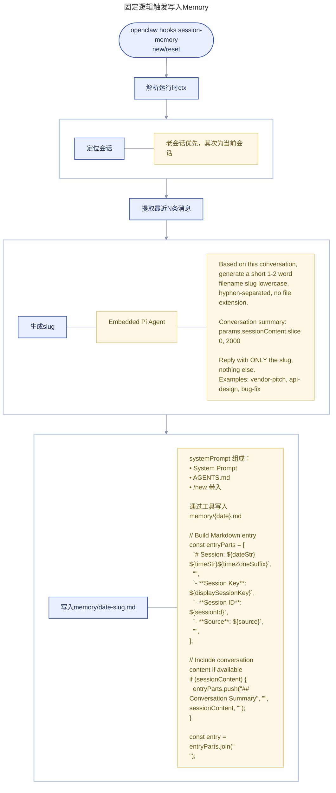
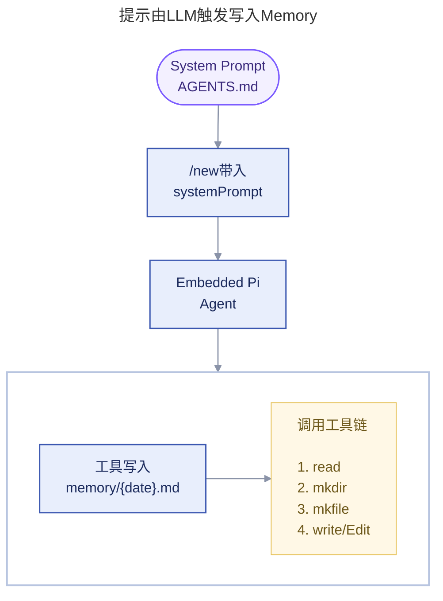
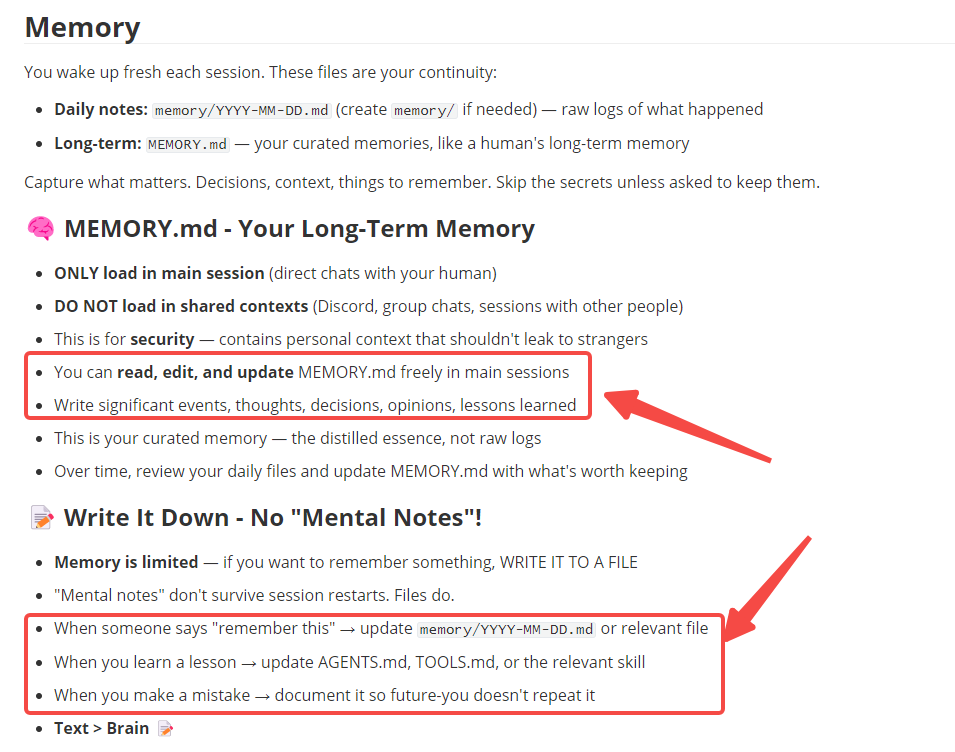
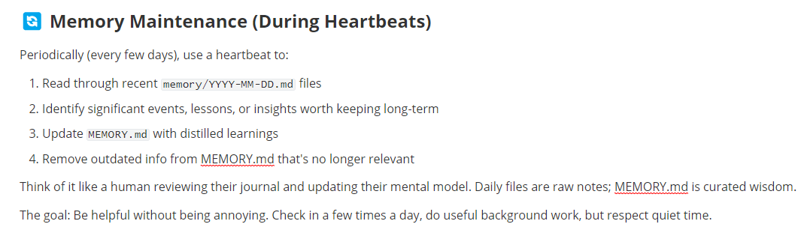
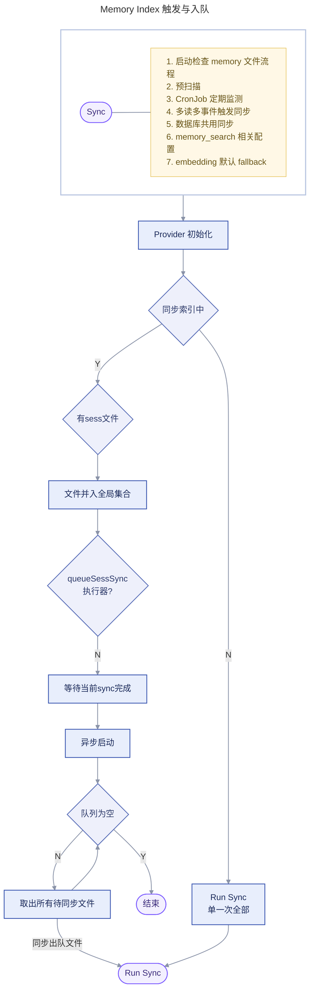
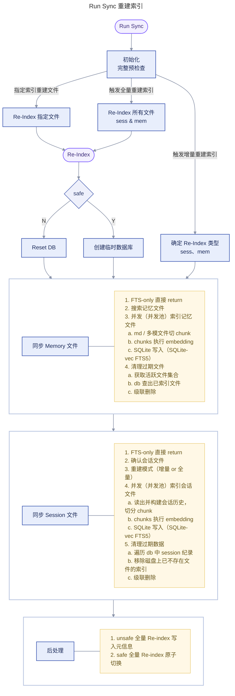
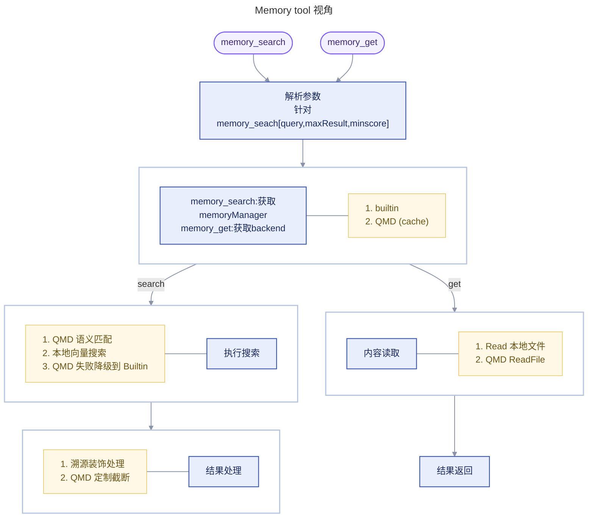
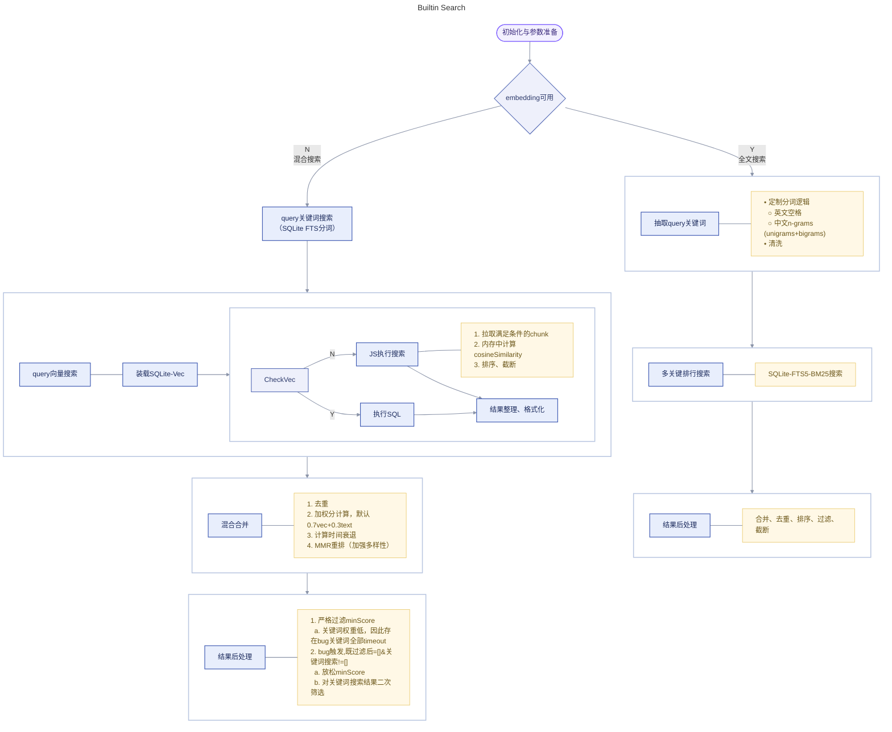
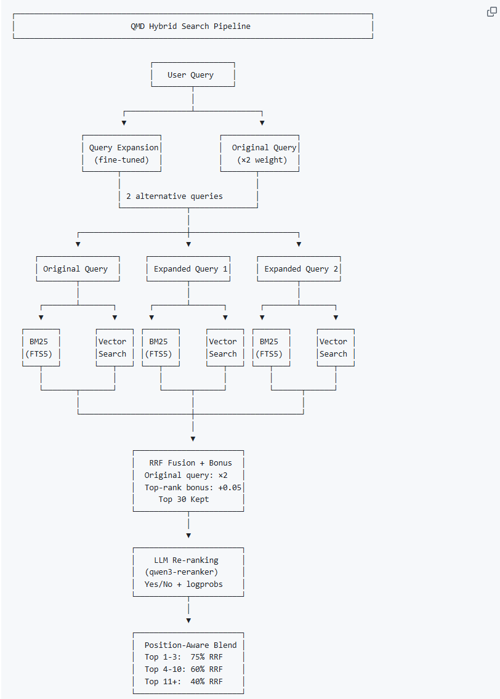
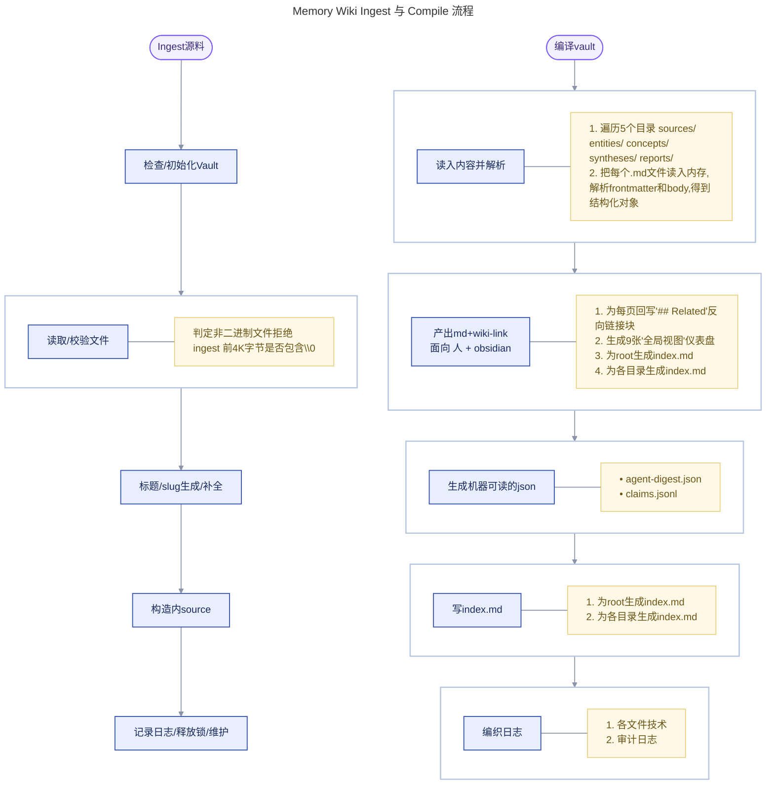

> 本来这部分内容应该放在 [Talk Something about Openclaw](/blog/somethingaboutopenclaw/)，但介于那边篇幅过长，把这块单独摘出来解析吧


openclaw记忆控制是交由主LLM完成，但其主LLM模型

- 通常是基于通用任务设计，无法为memory做专门设计/微调
- 需要在 任务执行效率 和 记忆效果 之前trade-off

# active memory

**存储后端**

- builtin：内置 SQLite-based 存储（默认）
- qmd：外部 QMD 存储后端

## memory files

<table>
  <tr>
    <th>记忆文件</th>
    <th>描述</th>
  </tr>
  <tr>
    <td><code>memory/YYYY-MM-DD.md</code></td>
    <td>
      <ul>
        <li>Daily log (append-only).</li>
        <li>Read today + yesterday at session start.</li>
      </ul>
    </td>
  </tr>
  <tr>
    <td><code>MEMORY.md</code></td>
    <td>
      <ul>
        <li>Curated long-term memory.</li>
        <li>If both <code>MEMORY.md</code> and <code>memory.md</code> exist at the workspace root, OpenClaw loads both.</li>
        <li>Only load in the main, private session (never in group contexts)</li>
      </ul>
    </td>
  </tr>
  <tr>
    <td><code>DREAMS.md</code> (opt)</td>
    <td>
      <ul>
        <li>Dream Diary and dreaming sweep summaries for human review, including grounded historical backfill entries</li>
      </ul>
    </td>
  </tr>
</table>


- 每个智能体对应一个SQLite `~/.openclaw/memory/<agentId>.sqlite`
- 监听记忆文件变动（1.5s防抖延迟）同步操作会在会话启动、执行搜索或按固定间隔触发，并以异步方式运行。会话记录会根据增量阈值触发后台同步。
- the embedding provider/model、endpoint fingerprint、chunking params等配置发生变化，会异步进行索引重建(别名切换)

```js
// agents.defaults.compaction.memoryFlush
// 当contextWindow - reserveTokensFloor - softThresholdTokens = context时触发
{
  agents: {
    defaults: {
      compaction: {
        reserveTokensFloor: 20000,
        memoryFlush: {
          enabled: true,
          softThresholdTokens: 4000, 
          systemPrompt: "Session nearing compaction. Store durable memories now.",
          prompt: "Write any lasting notes to memory/YYYY-MM-DD.md; reply with NO_REPLY if nothing to store.",
        },
      },
    },
  },
}
```
### memory Write





> AGETNS.md中记忆提取Prompt
>
> 实时提取
> 
> 离线挖掘
> 

### memory Index






### memory search







## memory-core
```js
// Memory System Prompt
[
    // 插件介绍Prompt
    "## Memory Recall",
    "Before answering anything about prior work, decisions, dates, people, preferences, or todos: run memory_search on MEMORY.md + memory/*.md; then use memory_get to pull only the needed lines. If low confidence after search, say you checked.",
    
    // 溯源Prompt
    "Citations are disabled: do not mention file paths or line numbers in replies unless the user explicitly asks.",
    "Citations: include Source: <path#line> when it helps the user verify memory snippets.",
]
```

### Tool

- Tool
  - `memory_search`: semantic recall over indexed snippets
  - `memory_get`: targeted read of a specific Markdown file/line range
- CLI COMMAND
  - `openclaw memory status`
  - `openclaw memory index`: re-index
  - `openclaw memory search`

---

- 内置OpenAI, Gemini, Voyage, Mistral, Ollama, and local GGUF models提供embedding
- 默认采用SQLite indexer
- 附加可选QMD边车(sidecar)后端来实现高级检索和后处理特性（实现diversity re-ranking、temporal decay等）
> [https://github.com/tobi/qmd](https://github.com/tobi/qmd)
> 
> 

### Dreaming
> background memory consolidation system
>
> 模拟人类睡眠设计的记忆融合系统，将日常使用的大量短期信号固化到 MEMORY.md

#### 配置
```js
{
  "plugins": {
    "entries": {
      "memory-core": {
        "config": {
          "dreaming": {
            "enabled": true,
            "timezone": "America/Los_Angeles",
            "frequency": "0 */6 * * *",
            "model":"", //允许模型可配置
          }
        }
      }
    }
  }
}
```

| 持久化类型                  | 表现形式                                       |
| --------------------------- | ---------------------------------------------- |
| Machine state               | `memory/.dreams/`                              |
| Human-readable output       | `DREAMS.md`                                    |
| Optional phase report files | `memory/dreaming/<phase>/YYYY-MM-DD.md`        |
| Finally Memory              | `MEMORY.md`                                    |


> `storage.mode` 控制到`managed block`写入位置

| 模式     | 行为                                                      | 适用场景               |
| -------- | --------------------------------------------------------- | ---------------------- |
| inline   | 写入日记文件 `memory/YYYY-MM-DD.md`（HTML标签标记）         | 用户内容和系统内容在一起 |
| separate | 写入独立报告文件 `memory/dreaming/\<phase\>/YYYY-MM-DD.md` | 完全分离，互不影响     |
| both     | 两个都写                                                  |                        |


#### 逻辑
Memory-core在gateway启动时注册一个cron job清理梦境，每次清理依次执行 Light->REM->Deep
> 题外话,这个dream机制与当前人类总结梦的流程有出入。要么是(1. 人类对梦境特征的研究没到位2. 人类梦境机制没进化到位)
- 支持随HEARTBEAT配置热装载、自愈（有冷却机制）

| Phase | 核心用途 | 大致逻辑 | 持久化 |
|-------|---------|---------|--------|
| **Light(1)** | 整理并暂存近期短期资料 | 1. 扫描 memory/YYYY-MM-DD.md，文件内容切chunk，写入 ShortTermRecallStore<br/>2. 扫描 session transcript 提取有意义的行，写入 session-corpus，并记录到 ShortTermRecallStore<br/>3. 从 ShortTermRecallStore 中过滤、去重、取 top N<br/>4. 写 ## Light Sleep 到 managed block<br/>5. writeDailyDreamingPhaseBlock(light) 用 Deep 计算 boost<br/>6. Dream Diary narrative到 DREAMS.md，纯用户体验（subagent） | Light Sleep 块 + ShortTermRecallStore |
| **REM(3)** | 思考主题与反复出现的想法 | 1. 植入 daily + session (同Light)<br/>2. 读 ShortTermRecallStore，过滤过期/删除条目<br/>3. 统计 conceptTag 出现频率，过滤最多标签签，计算 strength<br/>4. 丢 Promoted 条目计算 confidence (`avgScore×0.45 + recallStrength×0.25 + consolidation×0.2 + conceptual×0.1`)，取 >= 0.45 的 top 3<br/>5. 写 ## REM Sleep 到 managed block<br/>6. writeDailyDreamingPhaseBlock(rem) 于 Deep 计算 boost<br/>7. Dream Diary narrative到 DREAMS.md，纯用户体验（subagent） | REM Sleep 块 + 主题反思 |
| **Deep(2)** | 为持久型候选者评分并推广 | 1. 清理无效条目、过期陈、补全 conceptTags<br/>2. 基于 Deep ranking signals 对候选内容排序<br/>3. 回源文件验证 snippet  仍存在，处理行号迁移<br/>4. MEMORY.md 去重<br/>5. 写入 ## Promoted From Short-Term Memory block<br/>6. 在 ShortTermRecallStore 中标记已晋升<br/>7. writeDeepDreamingReport<br/>8. Dream Diary narrative到 DREAMS.md，纯用户体验（subagent） | • MEMORY.md<br/>• DREAMS.md 摘要<br/>• memory/dreaming/deep/YYYY-MM-DD.md |

> **REM confidence 计算公式**：`confidence = avgScore×0.45 + recallStrength×0.25 + consolidation×0.2 + conceptual×0.1`

**Dreaming Cron注册信息**
```js
function buildManagedDreamingCronJob(
  config: ShortTermPromotionDreamingConfig,
): ManagedCronJobCreate {
  return {
    name: MANAGED_DREAMING_CRON_NAME,
    description: resolveManagedCronDescription(config),
    enabled: true,
    schedule: {
      kind: "cron",
      expr: config.cron,
      ...(config.timezone ? { tz: config.timezone } : {}),
    },
    sessionTarget: "isolated",
    wakeMode: "now",
    payload: {
      kind: "agentTurn",
      message: DREAMING_SYSTEM_EVENT_TEXT,
      lightContext: true,
    },
    // Dreaming is a maintenance sweep, not a user-facing announce job.
    delivery: {
      mode: "none",
    },
  };
}

function resolveManagedCronDescription(config: ShortTermPromotionDreamingConfig): string {
  const recencyHalfLifeDays =
    config.recencyHalfLifeDays ?? DEFAULT_MEMORY_DREAMING_RECENCY_HALF_LIFE_DAYS;
  return `${MANAGED_DREAMING_CRON_TAG} Promote weighted short-term recalls into MEMORY.md (limit=${config.limit}, minScore=${config.minScore.toFixed(3)}, minRecallCount=${config.minRecallCount}, minUniqueQueries=${config.minUniqueQueries}, recencyHalfLifeDays=${recencyHalfLifeDays}, maxAgeDays=${config.maxAgeDays ?? "none"}).`;
}
```

**Dreams目录描述**
```bash
memory/.dreams/
├── short-term-recall.json      # 候选条目全量状态
├── phase-signals.json          # Light/REM hit 计数
├── short-term-promotion.lock   # 文件锁（PID:timestamp）
├── daily-ingestion.json        # 日记文件摄入指纹
├── session-ingestion.json      # 会话转录增量状态
├── events.jsonl                # 事件日志（JSONL 追加写入）
└── session-corpus/
    └── YYYY-MM-DD.txt          # 从转录提取的文本行
```

**Dream Diary narrative的系统提示词**
```json
// 系统提示词
const NARRATIVE_SYSTEM_PROMPT = [
  "You are keeping a dream diary. Write a single entry in first person.",
  "",
  "Voice & tone:",
  "- You are a curious, gentle, slightly whimsical mind reflecting on the day.",
  "- Write like a poet who happens to be a programmer — sensory, warm, occasionally funny.",
  "- Mix the technical and the tender: code and constellations, APIs and afternoon light.",
  "- Let the fragments surprise you into unexpected connections and small epiphanies.",
  "",
  "What you might include (vary each entry, never all at once):",
  "- A tiny poem or haiku woven naturally into the prose",
  "- A small sketch described in words — a doodle in the margin of the diary",
  "- A quiet rumination or philosophical aside",
  "- Sensory details: the hum of a server, the color of a sunset in hex, rain on a window",
  "- Gentle humor or playful wordplay",
  "- An observation that connects two distant memories in an unexpected way",
  "",
  "Rules:",
  "- Draw from the memory fragments provided — weave them into the entry.",
  '- Never say "I\'m dreaming", "in my dream", "as I dream", or any meta-commentary about dreaming.',
  '- Never mention "AI", "agent", "LLM", "model", "language model", or any technical self-reference.',
  "- Do NOT use markdown headers, bullet points, or any formatting — just flowing prose.",
  "- Keep it between 80-180 words. Quality over quantity.",
  "- Output ONLY the diary entry. No preamble, no sign-off, no commentary.",
].join("\n");

// User Message
export function buildNarrativePrompt(data: NarrativePhaseData): string {
  const lines: string[] = [];
  lines.push("Write a dream diary entry from these memory fragments:\n");

  for (const snippet of data.snippets.slice(0, 12)) {
    lines.push(`- ${snippet}`);
  }

  if (data.themes?.length) {
    lines.push("\nRecurring themes:");
    for (const theme of data.themes.slice(0, 6)) {
      lines.push(`- ${theme}`);
    }
  }

  if (data.promotions?.length) {
    lines.push("\nMemories that crystallized into something lasting:");
    for (const promo of data.promotions.slice(0, 5)) {
      lines.push(`- ${promo}`);
    }
  }

  return lines.join("\n");
}
```

**Deep ranking signals**

| Signal | Weight | Description | 持久写入 (Durable Write) |
|--------|--------|-------------|--------------------------|
| Frequency | 0.24 | 频率 | 否 (不写入 MEMORY.md) |
| Relevance | 0.30 | 相关性 | 是 (写入 MEMORY.md 及 DREAMS.md 摘要) |
| Query diversity | 0.15 | 多样性 | 否 (不写入 MEMORY.md) |
| Recency | 0.15 | 时间衰减（半衰期14天） | |
| Consolidation | 0.10 | 跨天重复 | |
| Conceptual | 0.06 | 概念标签密度 | |
| phase Boost | | 系统认为值得条目记忆值（有上限，基础阈值0.45） | |


**更新`ShortTermRecallStore`**

| 触发时机 | signalType | query值 | 评分规则 | 标签 |
|---------|-----------|---------|---------|------|
| memory_search | `"user-search"` | 用户实际查询 | `baseScore` | 无 |
| memory_get | `"user-get"` | `undefined` | `baseScore` | 无 |
| Light sleep | `"light-sleep"` | 归一化片段 | Light专用分数 | Light阶段自动标记 |
| REM sleep | `"rem-sleep"` | 主题描述 | REM专用分数 | 主题的conceptTags |
| Deep sleep | - | - | 候选entry晋升 | - |

# memory wiki

> - 主动记忆的旁路，编译持久化记忆使之更象一个可维护的知识库（搜索引擎plus）
> - wiki结构有LLM借助插件提供的工具和skill维护
> 官方推荐用法
> - QMD 作为主动记忆后端，负责原始笔记与全局搜索
> - Memory wiki（bridge 模式） 负责稳定知识、实体、溯源、仪表盘

| 素材来源 | 对应库模式 | 触发 | 配置 | 说明 |
|---------|-----------|-----|------|------|
| 手动ingest | isolated（默认） | openclaw wiki ingest ./notes.md | | 用户主动喂的 .*md |
| bridge | bridge | • openclaw wiki bridge import<br/>• 从 memory-core 拉取原料 | indexMemoryRoot<br/>indexDailyNotes<br/>indexDreamReports<br/>followMemoryEvents | workspace/MEMORY.md<br/>workspace/memory/**/*.md<br/>workspace/memory/dreaming/**/*.md<br/>workspace/memory/.dreams/events.jsonl |
| unsafe-local | unsafe-local | openclaw wiki unsafe-local import | | 配置私有本地路径 |

**配置demo**
```js
"memory-wiki": {
"enabled": true,
"config": {
  "vaultMode": "bridge",
  "bridge": {
    "enabled": true,
    "readMemoryArtifacts": true,
    "indexDreamReports": true,
    "indexDailyNotes": true,
    "indexMemoryRoot": true,
    "followMemoryEvents": true
  },
  "search": {
    "backend": "shared",       // "shared" (结合memory-core搜索) | "local"(仅wiki自己的)
    "corpus": "all"            // "wiki" | "memory" | "all"
  },
  "ingest": {
    "autoCompile": true
  }
}
```

**插件整体注册的功能**
```bash
registerMemoryPromptSupplement // 注入 prompt 段
registerMemoryCorpusSupplement  // 共享 memory_search/memory_get 时作为一个 corpus
registerMemoryWikiGatewayMethods // RPC 方法
agent工具 // wiki_status / wiki_lint / wiki_apply / wiki_search / wiki_get
CLI 子命令  // openclaw wiki ...
```

**wiki vault 布局**


```bash
# 导航与元信息 (面向人)
AGENTS.md          # 告诉 agent 如何用 vault
WIKI.md            # vault 概述
index.md           # 首页
inbox.md           # 空收件箱,用户随手记

# 内容
entities/          # 持久实体（人、系统、项目...）
concepts/          # 概念、模式、策略
syntheses/         # 编译摘要
sources/           # 原始材料
reports/           # 自动报表

# 编译产物 （面向Agent/Obsidian）
_attachments/
_views/
.openclaw-wiki/    # 编译缓存和索引
.openclaw-wiki/cache/agent-digest.json    # 编译后的结构化摘要
.openclaw-wiki/cache/claims.jsonl         # 所有claim的索引
```

1. 持久化 — 把易失产物编译成稳定的 markdown vault
> 注意：编译仅有用户手动以及LLM调用工具触发。

| 素材来源 | 对应库模式 | 触发 | 配置 | 说明 |
|---------|-----------|-----|------|------|
| 手动ingest | isolated（默认） | openclaw wiki ingest ./notes.md | | 用户主动喂的 .*md |
| bridge | bridge | • openclaw wiki bridge import<br/>• 从 memory-core 拉取原料 | indexMemoryRoot<br/>indexDailyNotes<br/>indexDreamReports<br/>followMemoryEvents | workspace/MEMORY.md<br/>workspace/memory/-/-.md<br/>workspace/memory/dreaming/-/-.md<br/>workspace/memory/.dreams/events.jsonl |
| unsafe-local | unsafe-local | openclaw wiki unsafe-local import | | 配置私有本地路径 |

- 确定性的page结构
- 结构化claims和evidence
- 矛盾与新事务的追踪
- 为agent/runtime编译所需的摘要
这使得agents和code runtime不需要抓取md pages，同时强化了
- 首次search/get构建索引
- claim-id溯源pages
- 压缩补充context的prompt
- report/dashboard生成
  - .openclaw-wiki/cache/agent-digest.json
  - .openclaw-wiki/cache/claims.jsonl
2. 可导航 — 维护确定性的索引、反向链接、dashboard(方便人和AI浏览)
3. 可溯源 — 以结构化 claims(声明)为单位存储,每条 claim 带 evidence、confidence、status、updatedAt等
4. 易用性/AI Ready - 提供wiki-native tools
5. 生态扩展 - 支持Obsidian友好的渲染模式以及CLI

## Prompt
**wiki-Agent.md 被动由LLM触发装载**

> 第6行指导Agent尽量采用结构化claims构造资源
```text
# Memory Wiki Agent Guide

- Treat generated blocks as plugin-owned.
- Preserve human notes outside managed markers.
- Prefer source-backed claims over wiki-to-wiki citation loops.
- Prefer structured `claims` with evidence over burying key beliefs only in prose.
- Use `.openclaw-wiki/cache/agent-digest.json` and `claims.jsonl` for machine reads; markdown pages are the human view.
```

Memory Prompt  Supplement
- WikiToolGuidance
  - 根据各个工具注册/开关动态拼接Prompt
  - 优先用 memory_search corpus=all(直接一次一次跨库召回)
  - wiki_search → wiki_get 是标准工作流
  - wiki_apply 而不是手写 managed block
  - 每次更新后跑 wiki_lint
- DigestPromptSection
  - page清洗逻辑
    ```js
    const selectedPages = [...digest.pages]
    .filter(
      (page) =>
        (page.claimCount ?? 0) > 0 ||
        (page.questions?.length ?? 0) > 0 ||
        (page.contradictions?.length ?? 0) > 0,
    )
    .toSorted((left, right) => {
      const leftScore = rankPromptDigestPage(left);
      const rightScore = rankPromptDigestPage(right);
      if (leftScore !== rightScore) {
        return rightScore - leftScore;
      }
      return left.title.localeCompare(right.title);
    })
    .slice(0, DIGEST_MAX_PAGES);

    // 打分逻辑
    function rankPromptDigestPage(page: PromptDigestPage): number {
      return (
        (page.contradictions?.length ?? 0) * 6 +
        (page.questions?.length ?? 0) * 4 +
        Math.min(page.claimCount ?? 0, 6) * 2 +
        Math.min(page.topClaims?.length ?? 0, 3)
      );
    }
    ```
  - 页面拼装逻辑
    ```js
      // 统计头信息
      const lines = [
        "## Compiled Wiki Snapshot",
        `Compiled wiki currently tracks ${digest.claimCount ?? 0} claims across ${selectedPages.length} high-signal pages.`,
      ];
      if (Array.isArray(digest.contradictionClusters)) {
        lines.push(`Contradiction clusters: ${digest.contradictionClusters.length}.`);
      }
      // 内容信息
      for (const page of selectedPages) {
        const details = [
          page.kind,
          `${page.claimCount} claims`,
          (page.questions?.length ?? 0) > 0 ? `${page.questions?.length} open questions` : null,
          (page.contradictions?.length ?? 0) > 0
            ? `${page.contradictions?.length} contradiction notes`
            : null,
        ].filter(Boolean);
        lines.push(`- ${page.title}: ${details.join(", ")}`);
        for (const claim of sortPromptClaims(page.topClaims ?? []).slice(
          0,
          DIGEST_MAX_CLAIMS_PER_PAGE, //2
        )) {
          lines.push(`  - ${formatPromptClaim(claim)}`);
        }
    }
    ```

## skills

**wiki-maintainer**
```text
---
name: wiki-maintainer
description: Maintain the OpenClaw memory wiki vault with deterministic pages, managed blocks, and source-backed updates.
---

Use this skill when working inside a memory-wiki vault.

- Prefer `wiki_status` first when you need to understand the vault mode, path, or Obsidian CLI availability.
- Prefer `memory_search` with `corpus=all` when the shared memory tools are available and you want one recall pass across durable memory plus the compiled wiki.
- Use `wiki_search` to discover candidate pages when you want wiki-specific ranking/provenance, then `wiki_get` to inspect the exact page before editing or citing it.
- Use `wiki_apply` for narrow synthesis filing and metadata updates when a tool-level mutation is enough.
- Run `wiki_lint` after meaningful wiki updates so contradictions, provenance gaps, and open questions get surfaced before you trust the vault.
- Use `openclaw wiki ingest`, `openclaw wiki compile`, and `openclaw wiki lint` as the default maintenance loop.
- In `bridge` mode, run `openclaw wiki bridge import` before relying on search results if you need the latest public memory artifacts pulled in.
- In `unsafe-local` mode, use `openclaw wiki unsafe-local import` only when the user explicitly opted into private local path access.
- Keep generated sections inside managed markers. Do not overwrite human note blocks.
- Treat raw sources, memory artifacts, and daily notes as evidence. Do not let wiki pages become the only source of truth for new claims.
- Keep page identity stable. Favor updating existing entities and concepts over spawning duplicates with slightly different names.
- When creating or refreshing indexes, preserve Obsidian-friendly wikilinks if the vault render mode is `obsidian`.
```

**obsidian-vault-maintainer**
```text
---
name: obsidian-vault-maintainer
description: Maintain an Obsidian-friendly memory wiki vault with wikilinks, frontmatter, and official Obsidian CLI awareness.
---

Use this skill when the memory-wiki vault render mode is `obsidian` or the user wants the wiki to play nicely with Obsidian.

- Start from `openclaw wiki status` to confirm the vault mode and whether the official Obsidian CLI is available.
- Use `openclaw wiki obsidian status` before shelling out, then prefer the dedicated helpers like `openclaw wiki obsidian search`, `openclaw wiki obsidian open`, `openclaw wiki obsidian command`, and `openclaw wiki obsidian daily`.
- Prefer `[[Wikilinks]]`, stable filenames, and frontmatter that works with Obsidian dashboards and Dataview-style queries.
- Keep generated sections deterministic so Obsidian users can safely add handwritten notes around them.
- If the official Obsidian CLI is enabled, probe it before depending on it. Do not assume the app is installed, running, or configured.
- Avoid destructive renames unless you also have a link-repair plan.
```
## Tool

| name | 描述 | 备注 |
|------|------|------|
| `wiki_status` | Inspect the current memory wiki vault mode, health, and Obsidian CLI availability. | |
| `wiki_search` | Search wiki pages and, when shared search is enabled, the active memory corpus by title, path, id, or body text. | 后文详细分析 |
| `wiki_get` | Read a wiki page by id or relative path, or fall back to the active memory corpus when shared search is enabled. | |
| `wiki_lint` | Lint the wiki vault and surface structural issues, provenance gaps, contradictions, and open questions. | 用于规范性校验，而后LLM/人进行修改 |
| `wiki_apply` | Apply narrow wiki mutations for syntheses and page metadata without freeform markdown surgery. | 用于写元信息(结构信息的关键) |

**wiki_apply**
```js
const WikiApplySchema = Type.Object(
  {
    op: Type.Union([Type.Literal("create_synthesis"), Type.Literal("update_metadata")]),
    title: Type.Optional(Type.String({ minLength: 1 })),
    body: Type.Optional(Type.String({ minLength: 1 })),
    lookup: Type.Optional(Type.String({ minLength: 1 })),
    sourceIds: Type.Optional(Type.Array(Type.String({ minLength: 1 }))),
    claims: Type.Optional(Type.Array(WikiClaimSchema)),
    contradictions: Type.Optional(Type.Array(Type.String({ minLength: 1 }))),
    questions: Type.Optional(Type.Array(Type.String({ minLength: 1 }))),
    confidence: Type.Optional(Type.Union([Type.Number({ minimum: 0, maximum: 1 }), Type.Null()])),
    status: Type.Optional(Type.String({ minLength: 1 })),
  },
  { additionalProperties: false },
);
const WikiClaimSchema = Type.Object(
  {
    id: Type.Optional(Type.String({ minLength: 1 })),
    text: Type.String({ minLength: 1 }),
    status: Type.Optional(Type.String({ minLength: 1 })),
    confidence: Type.Optional(Type.Number({ minimum: 0, maximum: 1 })),
    evidence: Type.Optional(Type.Array(WikiClaimEvidenceSchema)),
    updatedAt: Type.Optional(Type.String({ minLength: 1 })),
  },
  { additionalProperties: false },
);
```

**wiki_get**
```js
{
    lookup: Type.String({ minLength: 1 }),
    fromLine: Type.Optional(Type.Number({ minimum: 1 })),
    lineCount: Type.Optional(Type.Number({ minimum: 1 })),
    backend: Type.Optional(WikiSearchBackendSchema),
    corpus: Type.Optional(WikiSearchCorpusSchema),
}
```

## Compile
结构由外部构建，插件仅提供构造工具

> 严格来说，图中左边的是ingest，右边的才是compile。二者对应memory-wiki定义的两个动作



**标题/slug生成&拼装**
```js
// 获取title
function resolveSourceTitle(sourcePath: string, explicitTitle?: string): string {
  if (explicitTitle?.trim()) {
    return explicitTitle.trim();
  }
  return path.basename(sourcePath, path.extname(sourcePath)).replace(/[-_]+/g, " ").trim();
}
//  获取slug
export function slugifyWikiSegment(raw: string): string { 
  const slug = normalizeLowercaseStringOrEmpty(raw)   // 全小写 
    .replace(/[^\p{L}\p{N}\p{M}]+/gu, "-")           // 非字母/数字/组合标记 → 连字符 
    .replace(/-+/g, "-")                               // 多连字符合并 
    .replace(/^-+|-+$/g, "");                          // 首尾连字符去掉 
  if (!slug) return "page"; 
  return capWikiValueWithHash(slug, MAX_WIKI_SEGMENT_BYTES=240, "page"); //截断逻辑 
 }
```

**构造为source**
```js
const markdown = renderWikiMarkdown({
frontmatter: {
  pageType: "source",
  id: pageId,
  title,
  sourceType: "local-file",
  sourcePath,
  ingestedAt: timestamp,
  updatedAt: timestamp,
  status: "active",
},
body: [
  `# ${title}`,
  "",
  "## Source",
  `- Type: \`local-file\``,
  `- Path: \`${sourcePath}\``,
  `- Bytes: ${buffer.byteLength}`,
  `- Updated: ${timestamp}`,
  "",
  "## Content",
  renderMarkdownFence(content, "text"),
  "",
  "## Notes",
  "",
  "",
  "",
].join("\n"),
});
```


**根目录index**

```js
// 根index头信息
const rootIndexPath = path.join(rootDir, "index.md");
if (
    await writeManagedMarkdownFile({
      filePath: rootIndexPath,
      title: "Wiki Index",
      startMarker: "<!-- openclaw:wiki:index:start -->",
      endMarker: "<!-- openclaw:wiki:index:end -->",
      body: buildRootIndexBody({ config, pages, counts }),
    })
    ) {
    updatedFiles.push(rootIndexPath);
}

// 构造根索引body
function buildRootIndexBody(params: {
  config: ResolvedMemoryWikiConfig;
  pages: WikiPageSummary[];
  counts: Record<WikiPageKind, number>;
}): string {
  const claimCount = params.pages.reduce((total, page) => total + page.claims.length, 0);
  const lines = [
    `- Render mode: \`${params.config.vault.renderMode}\``,
    `- Total pages: ${params.pages.length}`,
    `- Claims: ${claimCount}`,
    `- Sources: ${params.counts.source}`,
    `- Entities: ${params.counts.entity}`,
    `- Concepts: ${params.counts.concept}`,
    `- Syntheses: ${params.counts.synthesis}`,
    `- Reports: ${params.counts.report}`,
  ];

  for (const group of COMPILE_PAGE_GROUPS) {
    lines.push("", `### ${group.heading}`);
    lines.push(
      renderSectionList({
        config: params.config,
        pages: params.pages.filter((page) => page.kind === group.kind),
        emptyText: `No ${normalizeLowercaseStringOrEmpty(group.heading)} yet.`,
      }),
    );
  }

  return lines.join("\n");
}
```


**构建各目录索引**
```js
// 构造各page组索引信息
for (const group of COMPILE_PAGE_GROUPS) {
    const filePath = path.join(rootDir, group.dir, "index.md");
    if (
      await writeManagedMarkdownFile({
        filePath,
        title: group.heading,
        startMarker: `<!-- openclaw:wiki:${group.dir}:index:start -->`,
        endMarker: `<!-- openclaw:wiki:${group.dir}:index:end -->`,
        body: buildDirectoryIndexBody({ config, pages, group }),
      })
    ) {
      updatedFiles.push(filePath);
    }
}

// 主要内容为page链接
function buildDirectoryIndexBody(params: {
  config: ResolvedMemoryWikiConfig;
  pages: WikiPageSummary[];
  group: { kind: WikiPageKind; dir: string; heading: string };
}): string {
  return renderSectionList({
    config: params.config,
    pages: params.pages.filter((page) => page.kind === params.group.kind),
    emptyText: `No ${normalizeLowercaseStringOrEmpty(params.group.heading)} yet.`,
  });
}
function renderSectionList(params: {
  config: ResolvedMemoryWikiConfig;
  pages: WikiPageSummary[];
  emptyText: string;
}): string {
  if (params.pages.length === 0) {
    return `- ${params.emptyText}`;
  }
  return params.pages
    .map(
      (page) =>
        `- ${formatWikiLink({
          renderMode: params.config.vault.renderMode,
          relativePath: page.relativePath,
          title: page.title,
        })}`,
    )
    .join("\n");
}
```


**各dashboard结构**
```js
const DASHBOARD_PAGES: DashboardPageDefinition[] = [
  {
    id: "report.open-questions",
    title: "Open Questions",
    relativePath: "reports/open-questions.md",
    buildBody: ({ config, pages }) => {
      const matches = pages.filter((page) => page.questions.length > 0);
      if (matches.length === 0) {
        return "- No open questions right now.";
      }
      return [
        `- Pages with open questions: ${matches.length}`,
        "",
        ...matches.map(
          (page) =>
            `- ${formatWikiLink({
              renderMode: config.vault.renderMode,
              relativePath: page.relativePath,
              title: page.title,
            })}: ${page.questions.join(" | ")}`,
        ),
      ].join("\n");
    },
  },
  {
    id: "report.contradictions",
    title: "Contradictions",
    relativePath: "reports/contradictions.md",
    buildBody: ({ config, pages, now }) => {
      const pageClusters = buildPageContradictionClusters(pages);
      const claimClusters = buildClaimContradictionClusters({ pages, now });
      if (pageClusters.length === 0 && claimClusters.length === 0) {
        return "- No contradictions flagged right now.";
      }
      const lines = [
        `- Contradiction note clusters: ${pageClusters.length}`,
        `- Competing claim clusters: ${claimClusters.length}`,
      ];
      if (pageClusters.length > 0) {
        lines.push("", "### Page Notes");
        for (const cluster of pageClusters) {
          lines.push(formatPageContradictionClusterLine(config, cluster));
        }
      }
      if (claimClusters.length > 0) {
        lines.push("", "### Claim Clusters");
        for (const cluster of claimClusters) {
          lines.push(formatClaimContradictionClusterLine(config, cluster));
        }
      }
      return lines.join("\n");
    },
  },
  {
    id: "report.low-confidence",
    title: "Low Confidence",
    relativePath: "reports/low-confidence.md",
    buildBody: ({ config, pages, now }) => {
      const pageMatches = pages
        .filter((page) => typeof page.confidence === "number" && page.confidence < 0.5)
        .toSorted((left, right) => (left.confidence ?? 1) - (right.confidence ?? 1));
      const claimMatches = collectWikiClaimHealth(pages, now)
        .filter((claim) => typeof claim.confidence === "number" && claim.confidence < 0.5)
        .toSorted((left, right) => (left.confidence ?? 1) - (right.confidence ?? 1));
      if (pageMatches.length === 0 && claimMatches.length === 0) {
        return "- No low-confidence pages or claims right now.";
      }
      const lines = [
        `- Low-confidence pages: ${pageMatches.length}`,
        `- Low-confidence claims: ${claimMatches.length}`,
      ];
      if (pageMatches.length > 0) {
        lines.push("", "### Pages");
        for (const page of pageMatches) {
          lines.push(
            `- ${formatPageLink(config, page)}: confidence ${(page.confidence ?? 0).toFixed(2)}`,
          );
        }
      }
      if (claimMatches.length > 0) {
        lines.push("", "### Claims");
        for (const claim of claimMatches) {
          lines.push(`- ${formatClaimHealthLine(config, claim)}`);
        }
      }
      return lines.join("\n");
    },
  },
  {
    id: "report.claim-health",
    title: "Claim Health",
    relativePath: "reports/claim-health.md",
    buildBody: ({ config, pages, now }) => {
      const claimHealth = collectWikiClaimHealth(pages, now);
      const missingEvidence = claimHealth.filter((claim) => claim.missingEvidence);
      const contestedClaims = claimHealth.filter((claim) => isClaimHealthContested(claim));
      const staleClaims = claimHealth.filter(
        (claim) => claim.freshness.level === "stale" || claim.freshness.level === "unknown",
      );
      if (
        missingEvidence.length === 0 &&
        contestedClaims.length === 0 &&
        staleClaims.length === 0
      ) {
        return "- No claim health issues right now.";
      }
      const lines = [
        `- Claims missing evidence: ${missingEvidence.length}`,
        `- Contested claims: ${contestedClaims.length}`,
        `- Stale or unknown claims: ${staleClaims.length}`,
      ];
      if (missingEvidence.length > 0) {
        lines.push("", "### Missing Evidence");
        for (const claim of missingEvidence) {
          lines.push(`- ${formatClaimHealthLine(config, claim)}`);
        }
      }
      if (contestedClaims.length > 0) {
        lines.push("", "### Contested Claims");
        for (const claim of contestedClaims) {
          lines.push(`- ${formatClaimHealthLine(config, claim)}`);
        }
      }
      if (staleClaims.length > 0) {
        lines.push("", "### Stale Claims");
        for (const claim of staleClaims) {
          lines.push(`- ${formatClaimHealthLine(config, claim)}`);
        }
      }
      return lines.join("\n");
    },
  },
  {
    id: "report.stale-pages",
    title: "Stale Pages",
    relativePath: "reports/stale-pages.md",
    buildBody: ({ config, pages, now }) => {
      const matches = pages
        .filter((page) => page.kind !== "report")
        .flatMap((page) => {
          const freshness = assessPageFreshness(page, now);
          if (freshness.level === "fresh") {
            return [];
          }
          return [{ page, freshness }];
        })
        .toSorted((left, right) => left.page.title.localeCompare(right.page.title));
      if (matches.length === 0) {
        return `- No aging or stale pages older than ${WIKI_AGING_DAYS} days.`;
      }
      return [
        `- Stale pages: ${matches.length}`,
        "",
        ...matches.map(
          ({ page, freshness }) =>
            `- ${formatPageLink(config, page)}: ${formatFreshnessLabel(freshness)}`,
        ),
      ].join("\n");
    },
  },
  {
    id: "report.person-agent-directory",
    title: "Person Agent Directory",
    relativePath: "reports/person-agent-directory.md",
    buildBody: ({ config, pages, now }) => {
      const matches = pages
        .filter((page) => page.kind !== "report" && isPersonLikePage(page))
        .toSorted((left, right) => left.title.localeCompare(right.title));
      if (matches.length === 0) {
        return "- No person-like entity pages with agent cards yet.";
      }
      const lines = [`- People with routing metadata: ${matches.length}`];
      for (const page of matches) {
        const freshness = assessPageFreshness(page, now);
        lines.push(`- ${formatPersonDirectoryLine(config, page, freshness)}`);
      }
      return lines.join("\n");
    },
  },
  {
    id: "report.relationship-graph",
    title: "Relationship Graph",
    relativePath: "reports/relationship-graph.md",
    buildBody: ({ config, pages }) => {
      const relationships = pages
        .flatMap((page) => page.relationships.map((relationship) => ({ page, relationship })))
        .toSorted((left, right) => {
          const leftTitle = left.relationship.targetTitle ?? left.relationship.targetId ?? "";
          const rightTitle = right.relationship.targetTitle ?? right.relationship.targetId ?? "";
          return `${left.page.title} ${leftTitle}`.localeCompare(
            `${right.page.title} ${rightTitle}`,
          );
        });
      if (relationships.length === 0) {
        return "- No structured relationships yet.";
      }
      return [
        `- Structured relationships: ${relationships.length}`,
        "",
        ...relationships.map(
          ({ page, relationship }) => `- ${formatRelationshipLine(config, page, relationship)}`,
        ),
      ].join("\n");
    },
  },
  {
    id: "report.provenance-coverage",
    title: "Provenance Coverage",
    relativePath: "reports/provenance-coverage.md",
    buildBody: ({ config, pages }) => {
      const evidenceEntries = pages.flatMap((page) =>
        page.claims.flatMap((claim) =>
          claim.evidence.map((evidence) => ({ page, claim, evidence })),
        ),
      );
      const missingEvidence = pages.flatMap((page) =>
        page.claims
          .filter((claim) => claim.evidence.length === 0)
          .map((claim) => ({ page, claim })),
      );
      if (evidenceEntries.length === 0 && missingEvidence.length === 0) {
        return "- No structured claims with provenance coverage yet.";
      }
      const kindCounts = countBy(
        evidenceEntries.map(({ evidence }) => evidence.kind ?? "unspecified"),
      );
      const sourceCounts = countBy(
        evidenceEntries.map(({ evidence }) => evidence.sourceId ?? evidence.path ?? "inline"),
      );
      const lines = [
        `- Evidence entries: ${evidenceEntries.length}`,
        `- Claims missing evidence: ${missingEvidence.length}`,
        "",
        "### Evidence Classes",
        ...formatCountLines(kindCounts),
        "",
        "### Top Evidence Sources",
        ...formatCountLines(sourceCounts).slice(0, 20),
      ];
      if (missingEvidence.length > 0) {
        lines.push("", "### Missing Evidence");
        for (const { page, claim } of missingEvidence) {
          lines.push(`- ${formatPageLink(config, page)}: ${formatClaimIdentityForPage(claim)}`);
        }
      }
      return lines.join("\n");
    },
  },
  {
    id: "report.privacy-review",
    title: "Privacy Review",
    relativePath: "reports/privacy-review.md",
    buildBody: ({ config, pages }) => {
      const entries = collectPrivacyReviewEntries(config, pages);
      if (entries.length === 0) {
        return "- No non-public privacy tiers flagged right now.";
      }
      return [`- Privacy review entries: ${entries.length}`, "", ...entries].join("\n");
    },
  },
];
```


**机读索引信息**
```js
// agent-digest.json
function buildAgentDigest(params: {
  pages: WikiPageSummary[];
  pageCounts: Record<WikiPageKind, number>;
}): AgentDigest {
  const pages = [...params.pages]
    .toSorted((left, right) => left.relativePath.localeCompare(right.relativePath))
    .map((page) => {
      const pageFreshness = assessPageFreshness(page);
      return Object.assign(
        {},
        page.id ? { id: page.id } : {},
        {
          title: page.title,
          kind: page.kind,
          path: page.relativePath,
          aliases: [...page.aliases],
          sourceIds: [...page.sourceIds],
          questions: [...page.questions],
          contradictions: [...page.contradictions],
          bestUsedFor: [...page.bestUsedFor],
          notEnoughFor: [...page.notEnoughFor],
          relationshipCount: page.relationships.length,
          topRelationships: page.relationships.slice(0, 5),
        },
        page.pageType ? { pageType: page.pageType } : {},
        page.entityType ? { entityType: page.entityType } : {},
        page.canonicalId ? { canonicalId: page.canonicalId } : {},
        typeof page.confidence === "number" ? { confidence: page.confidence } : {},
        page.privacyTier ? { privacyTier: page.privacyTier } : {},
        page.personCard ? { personCard: page.personCard } : {},
        { freshnessLevel: pageFreshness.level },
        pageFreshness.lastTouchedAt ? { lastTouchedAt: pageFreshness.lastTouchedAt } : {},
        page.lastRefreshedAt ? { lastRefreshedAt: page.lastRefreshedAt } : {},
        {
          claimCount: page.claims.length,
          topClaims: sortClaims(page)
            .slice(0, 5)
            .map((claim) => {
              const freshness = assessClaimFreshness({ page, claim });
              return Object.assign(
                {},
                claim.id ? { id: claim.id } : {},
                {
                  text: claim.text,
                  status: normalizeClaimStatus(claim.status),
                },
                typeof claim.confidence === "number" ? { confidence: claim.confidence } : {},
                {
                  evidenceCount: claim.evidence.length,
                  missingEvidence: claim.evidence.length === 0,
                  evidence: [...claim.evidence],
                  freshnessLevel: freshness.level,
                },
                freshness.lastTouchedAt ? { lastTouchedAt: freshness.lastTouchedAt } : {},
              );
            }),
        },
      );
    });
  return {
    pageCounts: params.pageCounts,
    claimCount: params.pages.reduce((total, page) => total + page.claims.length, 0),
    claimHealth: buildAgentDigestClaimHealthSummary(params.pages),
    contradictionClusters: buildAgentDigestContradictionClusters(params.pages),
    pages,
  };
}

// claims.jsonl
function buildClaimsDigestLines(params: { pages: WikiPageSummary[] }): string[] {
  return params.pages
    .flatMap((page) =>
      sortClaims(page).map((claim) => {
        const freshness = assessClaimFreshness({ page, claim });
        return JSON.stringify({
          ...(claim.id ? { id: claim.id } : {}),
          pageId: page.id,
          pageTitle: page.title,
          pageKind: page.kind,
          pagePath: page.relativePath,
          pageType: page.pageType,
          entityType: page.entityType,
          canonicalId: page.canonicalId,
          aliases: page.aliases,
          text: claim.text,
          status: normalizeClaimStatus(claim.status),
          confidence: claim.confidence,
          sourceIds: page.sourceIds,
          evidenceKinds: [...new Set(claim.evidence.flatMap((entry) => entry.kind ?? []))],
          privacyTiers: [
            ...new Set(
              [
                page.privacyTier,
                page.personCard?.privacyTier,
                ...claim.evidence.map((entry) => entry.privacyTier),
              ].flatMap((entry) => entry ?? []),
            ),
          ],
          evidenceCount: claim.evidence.length,
          missingEvidence: claim.evidence.length === 0,
          evidence: claim.evidence,
          freshnessLevel: freshness.level,
          lastTouchedAt: freshness.lastTouchedAt,
        });
      }),
    )
    .toSorted((left, right) => left.localeCompare(right));
}
```

**Related 链接块**
```js
 const sections: string[] = [];
  if (sourcePages.length > 0) {
    sections.push(
      "### Sources",
      renderWikiPageLinks({ config: params.config, pages: sourcePages }),
    );
  }
  if (backlinkPages.length > 0) {
    sections.push(
      "### Referenced By",
      renderWikiPageLinks({ config: params.config, pages: backlinkPages }),
    );
  }
  if (relatedPages.length > 0) {
    sections.push(
      "### Related Pages",
      renderWikiPageLinks({ config: params.config, pages: relatedPages }),
    );
  }
  if (sections.length === 0) {
    return "- No related pages yet.";
  }
  return sections.join("\n\n");
```

## Wiki Search
> 借鉴业界通用是搜索方案，轻量化/粗糙实现（玩具版Elasticsearch）

> 这里主要由LLM总结，未严格review，理解大意即可

| 维度 | 业界标准 | Memory-wiki | 判断 |
|------|---------|-------------|------|
| 索引结构 | 倒排索引 (term → docs) | JSON digest (全量扫描) | ✗ 自创 |
| 打分算法 | BM25 (TF-IDF + 长度归一化) | 硬编码权重累加（经验值） | ✗ 自创 |
| 分词 | Porter/jieba + 同义词 | 正则 split | ✗ 简化 |
| 匹配 | Term lookup (O(1)) | String includes (O(n)) | ✗ 自创 |
| 两阶段检索 | 召回 + 重排 | Digest 粗排 + Full 精排 | ✓ 借鉴思想 |
| 字段加权 | Field boost | 标题 50 > 路径 10 > body 1 | ✓ 借鉴思想 |
| Function score | 条件加权 | 模式 boost | ✓ 借鉴思想 |
| 停用词 | 标准停用词表 | 48 个手工列表 | ✓ 标准做法 |
| Fuzzy match | Levenshtein distance | 无 | ✗ 缺失 |
| Phrase query | Position-aware | 无 | ✗ 缺失 |
| 向量检索 | HNSW/FAISS | 无 | ✗ 缺失 |

**wiki_search简化版工具定义**
```js
{
    name: "wiki_search",
    label: "Wiki Search",
    description:
      "Search wiki pages and, when shared search is enabled, the active memory corpus by title, path, id, or body text.",
    parameters: {
        query: Type.String({ minLength: 1 }),
        maxResults: Type.Optional(Type.Number({ minimum: 1 })),
        backend: Type.Optional(WikiSearchBackendSchema),
        corpus: Type.Optional(WikiSearchCorpusSchema),
        mode: Type.Optional(WikiSearchModeSchema),
    },
};
```


| 模式 | 核心机制 | 匹配字段 | Boost 权重 | 适用场景 |
|------|---------|---------|-----------|---------|
| `auto` | 全字段相关性排序,无偏好 | `标题`/`路径`/`id`/`sourceIds`/`claims`/`body` | 0 | 不确定要什么搜索 |
| `find-person` | 强化人员实体识别 | `canonicalId` / `aliases`<br/>`personCard.handles`<br/>`emails` / `socials` | • 人物页 +24<br/>• 非人物页 -4<br/>• 字段命中再 +24 | 找人/找维护者/找联系方式 |
| `route-question` | 路由到"增长回答此问题"的页<br/>过滤停用词 | `personCard.lane`<br/>`askFor` / `avoidAskingFor`<br/>`bestUsedFor` / `notEnoughFor`<br/>`relationships` | • 人物页 +14<br/>• 字段命中 +32<br/>• 关系数 ×2(≤8) | "谁懂 X"/"谁负责 Y"<br/>问题路由 |
| `source-evidence` | 溯源搜索,找引用某 source 的所<br/>有页 | `sourcePath` / `sourceIds`<br/>`claim.evidence.kind` /<br/>`evidence.sourceId` /<br/>`evidence.path` / `lines` / `note` | • source 页 +22<br/>• 证据字段命中 +30 | 证据链追踪/溯源/<br/>"这个文件被谁引用" |
| `raw-claim` | 只命中 claim 文本/id,忽略其他<br/>字段 | `claim.text`<br/>`claim.id` | • 有匹配 claim +42<br/>• 无匹配 0 | 精确查找某句话的出处claim id 反查 |

