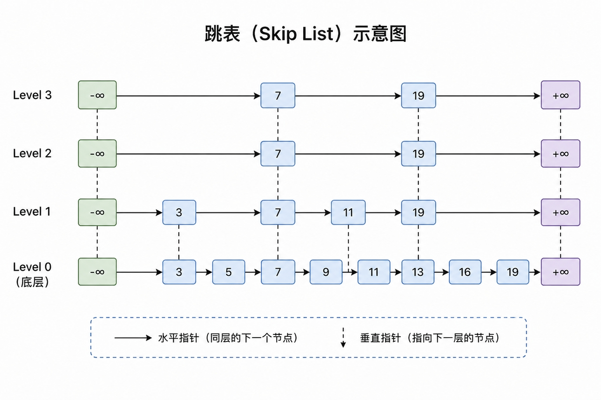
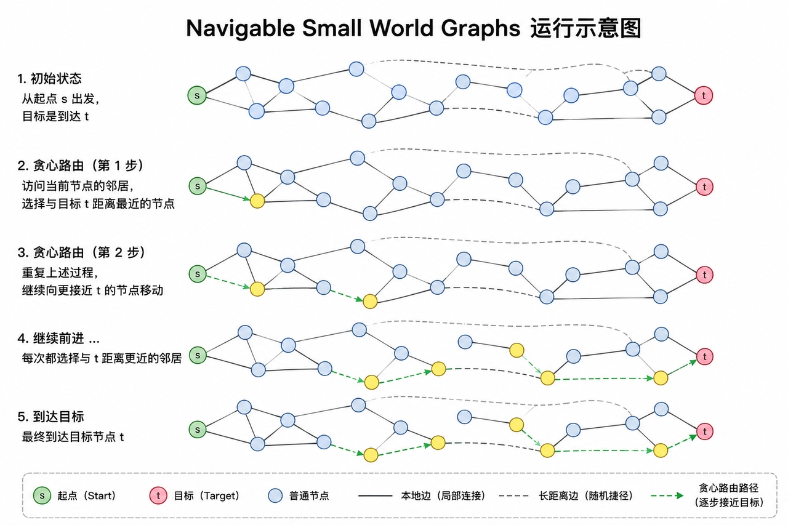
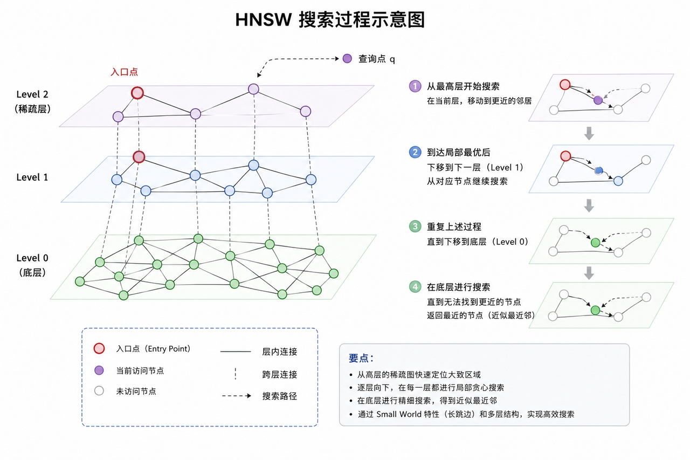

# 向量索引
> 基于海量向量索引，为追求效率，大多DB采用近似最近邻搜索

## FLAT
全量扫描索引，精度最高，速度最慢

## Inverted File (IVF)
> 基于空间分割的倒排索引结构，通过聚类将向量空间划分为多个Voronoi单元，每个聚类中心维护一个倒排列表

- 使用 K-Means 聚类算法训练得到 k 个聚类中心（centroids）
- 将数据集中的向量分配到最近的聚类中心，构建倒排列表（inverted lists）
- 查询过程
    1. 计算QVec与各聚类中心的距离，选出最近的 `nprobe` 个聚类中心
    2. 在这 `nprobe` 个倒排列表中进行搜索
    3. 合并结果并返回 top-k 最近邻

## Hierarchical Navigable Small World Graphs (HNSW)
> Malkov Y A, Yashunin D A. Efficient and robust approximate nearest neighbor search using hierarchical navigable small world graphs[J]. IEEE transactions on pattern analysis and machine intelligence, 2018, 42(4): 824-836.
> 
> 利用NSW的思想(贪心)，结合Skip List做工程上加速

Skip List 层次结构

NSW 图结构

HNSW 搜索过程

- 最小化跨层共享邻居的重叠时，就能获得最佳精度，但相应会增加平均搜索成本(超参数控制)
- 索引需要装入内存，因此比较吃内存

## DiskANN
> DiskANN: Fast Accurate Bilboko-Scale Nearest Neighbor Search on a Single Node
>
> SSD友好的图索引
>
> 大量向量和邻接信息放SSD,内存只保留必要的导航结构和缓存

- **Vamana算法**在构建索引图进行的边剪支时，提出采用超参数$\alpha$平衡图的度和直径(复杂度vs搜索效率)
- 索引设计
    - 基于k-means分簇，并构建重叠簇。即每个点属于$l$(通常为2)个簇
    - 每个cluster通过**Vamana算法**构建索引，而后合并多个cluster的图（重叠簇为其提供了良好的连通性）
- 索引布局
    - 量化（Product Quantization）后的向量在memory，全精度的图索引于SSD
    - 每个点，SSD连续存储其向量和相邻节点id（邻居不足直接padding）
- 支持Beam Search加速SSD IO
- 高频向量缓存（从起点3/4跳，太多内存压力大）
- 由于索引布局，每次拿邻居可以将全精度Vector带回，返回top-k时顺便进行精确计算（Re-Rank）,修正量化误差